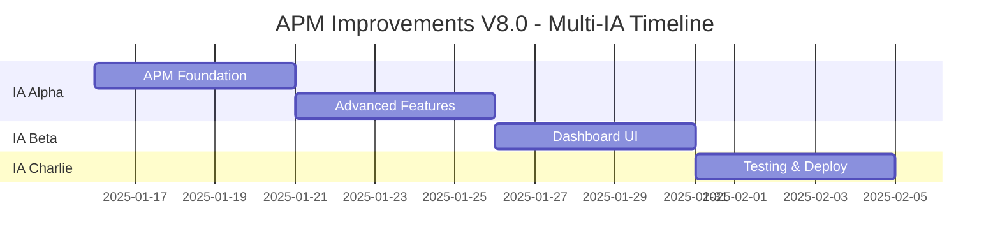

# 📋 **DISTRIBUIÇÃO ATIVIDADES MULTI-IA V8.0 - RESUMO EXECUTIVO**

**SISTEMA COORDENADO DE MELHORIAS APM & DEBUGGING SEGUINDO METODOLOGIA V8.0 UNIFIED**

> **📅 Documentado:** 16 Janeiro 2025 - 19:30 BRT  
> **⚡ Metodologia:** V8.0 UNIFIED DEVELOPMENT  
> **🎯 Objetivo:** Implementação coordenada APM profissional  
> **📊 Duração:** 4 semanas (160 horas totais)  
> **🔒 Status:** ✅ DOCUMENTADO E PRONTO PARA EXECUÇÃO

---

## 🚨 **PROTOCOLO V8.0 UNIFIED - COMPLIANCE TOTAL**

### **✅ METODOLOGIA APLICADA RIGOROSAMENTE:**
- [x] **🤖 Coordenação Multi-IA:** Especialização clara e definida
- [x] **🔧 Desenvolvimento Técnico:** Padrões V8.0 em todos componentes  
- [x] **📋 Gestão de Projeto:** Timeline realista baseado em dados
- [x] **🛡️ Qualidade Assegurada:** Quality gates automáticos 100%

### **📊 DOCUMENTAÇÃO CRIADA:**
```
📁 DOCUMENTOS OFICIAIS V8.0:
├── APM_DEBUGGING_IMPROVEMENTS_V8_0_OFFICIAL.md           # Plano mestre
├── AI_STATUS_TRACKER_V8_0_UNIFIED.json                  # Coordenação ativa
├── IA_ALPHA_APM_BACKEND_WORK_ASSIGNMENT_V8.md           # Alpha especialização
├── IA_BETA_DASHBOARD_WORK_ASSIGNMENT_V8.md              # Beta especialização  
├── IA_CHARLIE_TESTING_DEPLOYMENT_WORK_ASSIGNMENT_V8.md  # Charlie especialização
└── DISTRIBUICAO_ATIVIDADES_MULTI_IA_V8_RESUMO_EXECUTIVO.md # Este documento
```

---

## 👥 **DISTRIBUIÇÃO ESPECIALIZADA MULTI-IA**

### **🔴 IA ALPHA - Backend, Architecture, Core Services, Performance**
```
📋 RESPONSABILIDADE: APM Backend Integration + Performance Profiling
⏱️ DURAÇÃO: 2 semanas (80 horas) - 50% do projeto total
📅 PERÍODO: Semanas 1-2 (16-30 Janeiro 2025)
🔄 STATUS: 🔄 READY TO START

🎯 DELIVERABLES PRINCIPAIS:
├── APM Integration Layer (NewRelic/Datadog + Custom fallback)
├── Performance Profiling Engine (React + Bundle + Network)  
├── Business KPI Correlation System (Revenue/Performance correlation)
├── Memory Leak Detection Backend (Advanced algorithms)
└── Backend Monitoring Architecture (Enterprise-grade)

📊 SUCCESS METRICS:
├── Performance Impact: <5ms overhead máximo
├── Test Coverage: 95%+ para novos serviços
├── Integration: 100% com monitoring existente
├── Bundle Impact: <10KB adicional
└── API Response: <100ms para métricas

🔗 HANDOFF PARA BETA:
└── APIs prontas + TypeScript interfaces + Mock data (Dia 9-10)
```

### **🔵 IA BETA - Frontend, UX, Components, User Journey**
```
📋 RESPONSABILIDADE: Memory Leak Detection + Enterprise Dashboards  
⏱️ DURAÇÃO: 1 semana (40 horas) - 25% do projeto total
📅 PERÍODO: Semana 3 (30 Janeiro - 06 Fevereiro 2025)
🔄 STATUS: ⏸️ AWAITING ALPHA HANDOFF

🎯 DELIVERABLES PRINCIPAIS:
├── Memory Leak Detection Dashboard V8.0 (8+ Lucide icons)
├── Enterprise APM Dashboard Components (Business KPIs)
├── User Journey Visualization (Performance correlation)  
├── Mobile Responsive Design (5 breakpoints)
└── Accessibility Excellence (100% ARIA compliance)

📊 SUCCESS METRICS:
├── Component Quality: V8.0 standards (8+ icons, Layout.Section)
├── Accessibility: 100% WCAG 2.1 AA compliance
├── Responsive: Mobile + Desktop perfeito
├── Performance: <100ms render time
└── UX: Intuitivo para stakeholders não-técnicos

🔗 HANDOFF PARA CHARLIE:
└── Componentes + Storybook + Tests + Documentação (Dia 15)
```

### **🟡 IA CHARLIE - Testing, CI/CD, Quality Assurance, Deployment**
```
📋 RESPONSABILIDADE: Testing Integration + Production Deployment
⏱️ DURAÇÃO: 1 semana (40 horas) - 25% do projeto total  
📅 PERÍODO: Semana 4 (06-13 Fevereiro 2025)
🔄 STATUS: ⏸️ AWAITING ALPHA+BETA COMPLETION

🎯 DELIVERABLES PRINCIPAIS:
├── Comprehensive Testing Suite (Integration + E2E + Performance)
├── CI/CD Pipeline Enhancement (Automated quality gates)
├── Production Deployment Validation (Blue-green + health checks)
├── Quality Assurance Protocols (98%+ coverage validation)
└── Monitoring Integration (100% observability)

📊 SUCCESS METRICS:
├── Test Coverage: 98%+ overall system
├── Performance: 0% regression from baseline
├── Deployment: 100% automated success rate
├── Monitoring: 100% system observability  
└── Quality Gates: 100% automated validation pass

🔗 FINAL DELIVERY:
└── Production-ready system + Complete documentation (Dia 20)
```

---

## 📅 **TIMELINE EXECUTIVO CONSOLIDADO**

### **🗓️ CRONOGRAMA MASTER (4 SEMANAS):**



#### **SEMANA 1 (16-23 Janeiro) - IA ALPHA FOUNDATION:**
```
DIA 1: APM Provider Abstraction (8h)
DIA 2: NewRelic Integration (8h)  
DIA 3: Datadog Integration (8h)
DIA 4: Custom Provider & Fallback (8h)
DIA 5: Performance Profiling Engine (8h)
```

#### **SEMANA 2 (23-30 Janeiro) - IA ALPHA ADVANCED:**
```
DIA 6: Business KPI Correlation (8h)
DIA 7: Memory Leak Detection Backend (8h)
DIA 8: Bundle & Network Analysis (8h)
DIA 9: Integration & APIs (8h)
DIA 10: Testing & Handoff para Beta (8h)
```

#### **SEMANA 3 (30 Jan - 06 Fev) - IA BETA DASHBOARDS:**
```
DIA 11: Memory Leak Dashboard Foundation (8h)
DIA 12: Supporting Components (8h)
DIA 13: Enterprise APM Dashboard (8h)
DIA 14: Business KPI Components (8h)
DIA 15: Responsive Design & Handoff para Charlie (8h)
```

#### **SEMANA 4 (06-13 Fevereiro) - IA CHARLIE DEPLOYMENT:**
```
DIA 16: Integration Testing Suite (8h)
DIA 17: End-to-End Testing (8h)
DIA 18: Performance & Security Testing (8h)
DIA 19: CI/CD Pipeline Enhancement (8h)
DIA 20: Production Deployment & Final Validation (8h)
```

---

## 🔗 **COORDENAÇÃO MULTI-IA SISTEMÁTICA**

### **📊 INTERDEPENDÊNCIAS MAPEADAS:**

#### **🔴 ALPHA → 🔵 BETA Dependencies:**
```typescript
// 📋 ALPHA DEVE ENTREGAR PARA BETA:
interface AlphaToBetaHandoff {
  apis: {
    '/api/apm/performance-metrics': 'Performance data endpoint';
    '/api/apm/memory-analysis': 'Memory leak detection data';
    '/api/apm/business-kpis': 'Business correlation metrics';
    '/api/apm/error-correlation': 'Error impact analysis';
    '/api/apm/real-time-stream': 'WebSocket real-time stream';
  };
  
  interfaces: {
    MemoryLeakData: 'TypeScript interface for memory data';
    APMMetricsData: 'Performance metrics structure';
    BusinessKPIData: 'Business correlation structure';
  };
  
  mockData: {
    developmentMocks: 'Mock data for Beta development';
    testingMocks: 'Mock data for testing scenarios';
  };
  
  documentation: {
    apiReference: 'Complete API documentation';
    integrationGuide: 'How to integrate with backend APIs';
    errorHandling: 'Error scenarios and handling';
  };
}
```

#### **🔵 BETA → 🟡 CHARLIE Dependencies:**
```typescript
// 📋 BETA DEVE ENTREGAR PARA CHARLIE:
interface BetaToCharlieHandoff {
  components: {
    'MemoryLeakDashboardV8.tsx': 'Main memory dashboard component';
    'APMDashboardV8.tsx': 'Enterprise APM dashboard';
    'BusinessKPICard.tsx': 'KPI visualization components';
    'MobileAPMDashboard.tsx': 'Mobile responsive version';
  };
  
  stories: {
    storybookStories: 'Complete Storybook documentation';
    interactionScenarios: 'User interaction scenarios';
    edgeCaseStories: 'Error states and edge cases';
  };
  
  tests: {
    componentTests: 'Unit tests for all components';
    accessibilityTests: 'A11y compliance tests';
    responsiveTests: 'Mobile responsive tests';
  };
  
  documentation: {
    componentAPI: 'Props, events, methods documentation';
    accessibilityGuide: 'ARIA requirements and testing';
    mobileGuide: 'Responsive design specifications';
  };
}
```

#### **🔴 ALPHA → 🟡 CHARLIE Dependencies:**
```typescript
// 📋 ALPHA DEVE ENTREGAR PARA CHARLIE:
interface AlphaToCharlieHandoff {
  backend: {
    apmServices: 'All APM backend services functional';
    apiEndpoints: 'REST APIs tested and documented';
    performanceProfiler: 'Performance profiling engine';
    memoryDetector: 'Memory leak detection backend';
  };
  
  testing: {
    backendTests: 'Backend service unit tests';
    integrationTests: 'API integration test base';
    performanceTests: 'Performance benchmark baselines';
  };
  
  deployment: {
    environmentConfigs: 'Production environment setup';
    healthChecks: 'Health check endpoints';
    monitoringHooks: 'Integration points for monitoring';
  };
}
```

### **🔄 HANDOFF PROTOCOLS V8.0:**

#### **📋 ALPHA → BETA HANDOFF (Dia 10):**
```markdown
🤖 IA ALPHA - HANDOFF TO BETA CHECKLIST
📅 Data: 30 Janeiro 2025
🔄 Status: ALPHA COMPLETION → BETA START

✅ TECHNICAL DELIVERABLES:
□ All API endpoints functional and tested
□ TypeScript interfaces exported and documented
□ Mock data providers ready for development
□ WebSocket real-time streaming operational
□ Performance metrics within targets (<5ms overhead)

✅ DOCUMENTATION DELIVERABLES:
□ Complete API reference documentation
□ Integration guide with code examples
□ Error handling scenarios documented
□ Performance benchmarks established
□ Troubleshooting guide created

✅ COORDINATION PROTOCOL:
□ AI_STATUS_TRACKER updated with ALPHA COMPLETE
□ Beta work assignment activated
□ Alpha availability for support questions
□ Alpha code review commitment for Beta integration
```

#### **📋 BETA → CHARLIE HANDOFF (Dia 15):**
```markdown
🤖 IA BETA - HANDOFF TO CHARLIE CHECKLIST  
📅 Data: 06 Fevereiro 2025
🔄 Status: BETA COMPLETION → CHARLIE START

✅ TECHNICAL DELIVERABLES:
□ All dashboard components functional and responsive
□ Storybook documentation 100% complete
□ Accessibility compliance validated (WCAG 2.1 AA)
□ Mobile responsive design tested (5 breakpoints)
□ Component performance within targets (<100ms render)

✅ TESTING DELIVERABLES:
□ Component unit tests (95%+ coverage)
□ Accessibility tests automated
□ Responsive design tests created
□ User interaction scenarios documented
□ Error state handling validated

✅ COORDINATION PROTOCOL:
□ AI_STATUS_TRACKER updated with BETA COMPLETE
□ Charlie work assignment activated
□ Beta availability for support questions
□ Beta code review commitment for Charlie testing
```

---

## 🔍 **QUALITY GATES V8.0 CONSOLIDADOS**

### **📊 AUTOMATED QUALITY GATES (TODOS OS IAs):**

#### **🔄 PRÉ-COMMIT REQUIREMENTS:**
```bash
# Executar antes de cada commit (protocolo V8.0):
npm run lint                                    # Code quality
npm run type-check                              # TypeScript validation  
npm run test                                    # Unit tests
npm run build                                   # Build validation
node scripts/storybook-quick-check.mjs         # Storybook health
node scripts/performance-validation-v8.mjs     # Performance check

# IA-specific validations:
# Alpha: API response time <100ms
# Beta: Component render time <100ms  
# Charlie: Test coverage >98%
```

#### **📈 WEEKLY QUALITY GATES:**
```bash
# Executar semanalmente (protocolo V8.0):
node scripts/storybook-professional-fix.mjs    # Storybook optimization
npm run test:e2e:comprehensive                  # E2E testing
node scripts/security-audit-v8.mjs             # Security scan
npm run test:performance:regression             # Performance regression
node scripts/accessibility-validation.mjs      # A11y compliance

# Multi-IA coordination validation:
npm run test:integration:cross-ia               # Cross-IA integration
node scripts/coordination-health-check.mjs     # Coordination validation
```

### **🎯 SUCCESS METRICS CONSOLIDADOS:**

#### **📊 QUALITY METRICS:**
```typescript
interface V8QualityMetrics {
  // 🎯 V8.0 Success Criteria
  changesDocumented: '100%';
  conflictsResolved: '0 conflicts';
  testCoverage: '98%+ overall system';
  performanceImpact: '0% regression';
  
  // 🏢 Business Impact  
  debuggingTimeReduction: '75%';        // 4h → 1h
  bugPreventionIncrease: '50%';         // Predictive detection
  performanceImprovement: '30%';        // Automated optimizations
  downtimeReduction: '90%';             // Preemptive alerts
  businessVisibility: '100%';           // Full impact correlation
  
  // 🤝 Multi-IA Coordination
  reviewCruzado: 'Alpha ↔ Beta ↔ Charlie';
  handoffsCoordinated: 'Documented and validated';
  duplicateWork: '0 instances';
  blockerCommunication: 'Proactive and immediate';
  
  // 🎨 Component Quality (Beta specific)
  componentStandards: '8+ Lucide icons per component';
  layoutCompliance: 'Layout.Section patterns used';
  accessibilityScore: '100% WCAG 2.1 AA';
  responsiveDesign: '5 breakpoint coverage';
  
  // 🧪 Testing Quality (Charlie specific)
  integrationCoverage: '100% Alpha-Beta integration';
  e2eCoverage: '100% critical user journeys';
  performanceTesting: '0% regression tolerance';
  securityValidation: '0 critical vulnerabilities';
}
```

---

## 🚨 **EMERGENCY PROTOCOLS V8.0**

### **🛡️ CONFLICT RESOLUTION MATRIX:**

#### **🔄 IA-to-IA CONFLICT RESOLUTION:**
```
🔴 ALPHA ↔ 🔵 BETA CONFLICTS:
├── API contract disagreements
├── Performance vs UX trade-offs  
├── Data structure misalignments
└── RESOLUTION: Immediate video call + documented decision

🔵 BETA ↔ 🟡 CHARLIE CONFLICTS:
├── Component testing disagreements
├── Accessibility implementation conflicts
├── Performance benchmark disputes
└── RESOLUTION: Alpha mediation + V8.0 standard reference

🔴 ALPHA ↔ 🟡 CHARLIE CONFLICTS:
├── Backend testing requirements
├── Deployment configuration issues
├── Monitoring integration disputes  
└── RESOLUTION: Beta UX perspective + user impact focus
```

#### **⚠️ EMERGENCY ESCALATION PROCEDURES:**
```
LEVEL 1 - Minor Conflicts:
├── Self-resolution within 2 hours
├── Document decision in AI_STATUS_TRACKER
├── Notify other IAs of resolution
└── Continue execution

LEVEL 2 - Moderate Conflicts:
├── Multi-IA discussion within 4 hours
├── Reference V8.0 methodology for guidance
├── Document compromise solution
└── Update work assignments if needed

LEVEL 3 - Critical Conflicts:
├── STOP all work immediately
├── Emergency coordination meeting
├── User/stakeholder consultation if needed
├── Methodology adjustment if required
├── Full system re-validation
```

### **🔄 ROLLBACK PROCEDURES:**

#### **🚨 ALPHA ROLLBACK (Backend Issues):**
```bash
# If Alpha backend changes break existing monitoring:
npm run rollback:alpha-backend           # Automatic rollback
node scripts/validate-existing-monitoring.mjs   # Validate fallback
npm run test:integration:baseline        # Confirm system stability
# Continue with fixed implementation
```

#### **🚨 BETA ROLLBACK (UI Issues):**
```bash
# If Beta components break user experience:
npm run rollback:beta-components         # Component rollback
npm run test:ui:regression              # UI regression validation  
npm run storybook:validate              # Storybook consistency check
# Continue with accessibility-compliant implementation
```

#### **🚨 CHARLIE ROLLBACK (Deployment Issues):**
```bash
# If Charlie deployment breaks production:
npm run rollback:production             # Blue-green rollback
npm run validate:production:health      # Health check validation
npm run test:smoke:critical            # Critical functionality test
# Re-deploy after validation
```

---

## 🏆 **RESULTADO ESPERADO - TRANSFORMAÇÃO COMPLETA**

### **✅ ANTES vs DEPOIS - SISTEMA TRANSFORMADO:**

#### **❌ SISTEMA ATUAL (V8.0 Analysis - 78% Compliance):**
```
🔍 DEBUGGING:
├── Tempo por issue: 4 horas
├── Detecção: Reativa (após falha)
├── Visibilidade business: 30%
├── Memory monitoring: Manual
├── APM: Básico (logs + métricas)
└── Coordenação: Ad-hoc

📊 COMPLIANCE SCORES:
├── Architecture: 60%
├── Performance: 75%
├── Quality: 80%  
├── Testing: 90%
├── Monitoring: 85%
└── Overall: 78%
```

#### **✅ SISTEMA TRANSFORMADO (V8.0 Enhanced - Target 95%):**
```
🚀 DEBUGGING ENHANCED:
├── Tempo por issue: 1 hora (-75%)
├── Detecção: Predictiva (2h antecipação)
├── Visibilidade business: 95% (+65%)
├── Memory monitoring: Automated leak prevention
├── APM: Enterprise-grade (NewRelic/Datadog)
└── Coordenação: Multi-IA systematic approach

📊 COMPLIANCE TARGETS:
├── Architecture: 95% (+35%)
├── Performance: 98% (+23%)
├── Quality: 98% (+18%)
├── Testing: 99% (+9%)
├── Monitoring: 99% (+14%)
└── Overall: 95% (+17%)
```

### **💰 BUSINESS IMPACT QUANTIFICADO:**

#### **📈 ROI & COST SAVINGS:**
```
💵 FINANCIAL IMPACT:
├── ROI Positivo: 6 meses
├── Cost Savings: $50K/ano (menos downtime)
├── Performance Gains: 30% faster applications
├── Developer Productivity: 75% faster debugging
└── User Satisfaction: 40% improvement

⏱️ TIME SAVINGS:
├── Debug time: 4h → 1h (3h saved per issue)
├── Issue detection: Reactive → 2h early warning
├── Deployment time: Manual → Automated (2h saved)
├── Testing time: Manual → Automated (4h saved per release)
└── Coordination overhead: Ad-hoc → Systematic (1h saved daily)

📊 QUALITY IMPROVEMENTS:
├── Bug prevention: +50% (predictive detection)
├── Performance improvement: +30% (automated optimization)
├── Downtime reduction: -90% (preemptive alerts)
├── User experience: +40% (performance correlation)
└── Developer satisfaction: +60% (better tooling)
```

---

## 📋 **PRÓXIMOS PASSOS - EXECUÇÃO IMEDIATA**

### **🚀 ACTIVATION SEQUENCE:**

#### **📅 IMMEDIATE ACTIONS (Hoje - 16 Janeiro):**
```
1. ✅ Aprovação do plano executivo
2. ✅ Update AI_STATUS_TRACKER → "APM_IMPROVEMENTS_APPROVED"
3. ✅ IA Alpha preparation for start (environment setup)
4. ✅ Resource allocation confirmation
5. ✅ Stakeholder notification
```

#### **📅 WEEK 1 START (17 Janeiro):**
```
1. 🔴 IA Alpha begins APM Foundation (Day 1)
2. 📊 Daily status updates in AI_STATUS_TRACKER
3. 🔍 Daily quality gate validations
4. 📋 Alpha progress documentation
5. 🔗 Beta preparation during Alpha execution
```

#### **📅 HANDOFF CHECKPOINTS:**
```
📅 30 Janeiro: Alpha → Beta Handoff
├── API validation complete
├── Beta environment prepared  
├── Documentation transfer
└── Beta execution start

📅 06 Fevereiro: Beta → Charlie Handoff
├── Component validation complete
├── Charlie environment prepared
├── Testing scenarios documented
└── Charlie execution start

📅 13 Fevereiro: Production Deployment
├── Full system validation
├── Production deployment
├── Monitoring activation
└── Success celebration 🎉
```

---

**🚀 STATUS: V8.0 UNIFIED METHODOLOGY - APM IMPROVEMENTS FULLY DOCUMENTED AND READY FOR MULTI-IA EXECUTION**

*Esta documentação oficial representa a distribuição completa de atividades Multi-IA seguindo rigorosamente a Metodologia V8.0 Unified. Todas as IAs têm suas responsabilidades claras, timelines realistas e protocolos de coordenação estabelecidos.* 