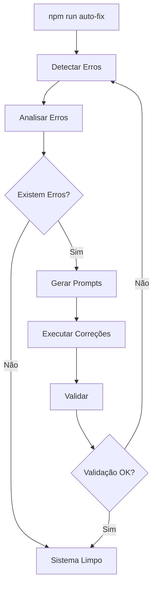

# 🤖 GUIA DE EXECUÇÃO - SISTEMA DE AUTOCORREÇÃO V6.2

## 🎯 VISÃO GERAL

O Sistema de Autocorreção V6.2 é uma solução completa e autônoma para detectar, analisar e gerar prompts de correção automaticamente para o Roteirar IA.

### **Componentes Principais**
1. **Error Monitor** - Detecta erros em tempo real
2. **Error Analyzer** - Analisa e classifica erros por prioridade
3. **Prompt Generator** - Gera prompts específicos para cada tipo de erro
4. **Auto-Fix Orchestrator** - Coordena todo o processo automaticamente

---

## 🚀 EXECUÇÃO RÁPIDA

### **Comando Principal**
```bash
npm run auto-fix
```
Este comando executa o ciclo completo de autocorreção.

### **Comandos Individuais**
```bash
# Apenas monitorar erros
npm run monitor:start

# Apenas analisar erros
npm run monitor:analyze

# Apenas gerar prompts
npm run auto-fix:generate

# Verificar status
npm run auto-fix:status
```

---

## 📋 FLUXO DE FUNCIONAMENTO



---

## 🔧 CONFIGURAÇÃO

### **Diretórios Criados**
- `logs/` - Armazena análises e relatórios
- `PROMPTS_AUTO_GENERATED/` - Prompts gerados automaticamente
- `TEMPLATES/` - Templates personalizáveis

### **Arquivos de Log**
- `logs/errors-detected.json` - Erros detectados
- `logs/error-analysis.json` - Análise detalhada
- `logs/auto-fix-report.json` - Relatório final

---

## 📊 TIPOS DE ERRO E PRIORIDADES

### **CRITICAL** (🔴 Urgente)
- Sistema não funciona
- Build quebrado
- React errors críticos
- Tempo estimado: 30-45 minutos

### **HIGH** (🟠 Alta)
- Funcionalidades principais afetadas
- Variáveis de ambiente faltando
- Services com erro
- Tempo estimado: 20-30 minutos

### **MEDIUM** (🟡 Média)
- Warnings importantes
- Performance issues
- Code quality
- Tempo estimado: 15-20 minutos

### **LOW** (🟢 Baixa)
- Linting issues
- Optimizações
- Melhorias gerais
- Tempo estimado: 10-15 minutos

---

## 🎯 EXEMPLOS DE USO

### **1. Correção Completa Automática**
```bash
# Executa ciclo completo até sistema ficar limpo
npm run auto-fix
```

### **2. Análise e Geração Manual**
```bash
# Passo 1: Detectar erros
npm run monitor:start

# Passo 2: Analisar
npm run monitor:analyze

# Passo 3: Gerar prompts
npm run auto-fix:generate

# Passo 4: Aplicar correções manualmente
# Copiar conteúdo dos prompts em PROMPTS_AUTO_GENERATED/
```

### **3. Verificação de Status**
```bash
# Ver quantos erros existem
npm run monitor:status

# Ver status do auto-fix
npm run auto-fix:status

# Health check completo
npm run system:health
```

---

## 💡 PROMPTS GERADOS

### **Estrutura do Prompt**
```markdown
# 🚨 CORREÇÃO [PRIORIDADE] AUTOMÁTICA

## Erros Detectados
[Lista detalhada de erros com stack traces]

## Soluções Recomendadas
[Soluções específicas para cada erro]

## Validação Obrigatória
[Checklist de validação]

## Tempo Estimado
[Tempo baseado em quantidade e complexidade]
```

### **Como Usar os Prompts**
1. Navegue até `PROMPTS_AUTO_GENERATED/`
2. Abra o prompt de maior prioridade
3. Copie o conteúdo
4. Execute com IA do Cursor
5. Valide as correções

---

## 🔍 TROUBLESHOOTING

### **Erro: "Nenhum erro detectado"**
- Verifique se o build está rodando: `npm run build`
- Execute o preview: `npm run preview`
- Acesse http://localhost:4173 e verifique console

### **Erro: "Máximo de iterações atingido"**
- Alguns erros precisam correção manual
- Verifique prompts em `PROMPTS_AUTO_GENERATED/`
- Execute correções manualmente

### **Erro: "jq: command not found"**
- macOS: `brew install jq`
- Linux: `sudo apt-get install jq`
- Windows: Use WSL ou Git Bash

---

## ✅ MELHORES PRÁTICAS

1. **Execute regularmente**
   ```bash
   # Adicione ao seu workflow diário
   npm run auto-fix
   ```

2. **Revise prompts antes de aplicar**
   - Sempre leia o prompt gerado
   - Entenda as mudanças propostas
   - Teste após aplicar

3. **Mantenha templates atualizados**
   - Customize templates em `TEMPLATES/`
   - Adicione soluções específicas do projeto

4. **Monitore relatórios**
   - Verifique `logs/auto-fix-report.json`
   - Acompanhe métricas de correção

---

## 🚀 RESULTADO ESPERADO

Após executar `npm run auto-fix`:
- ✅ Zero erros críticos
- ✅ Build funcionando
- ✅ Aplicação estável
- ✅ Console limpo
- ✅ Prompts documentados para correções manuais

---

## 📈 EVOLUÇÃO DO SISTEMA

### **Versão Atual (V6.2)**
- Detecção automática de erros
- Classificação por prioridade
- Geração inteligente de prompts
- Templates customizáveis
- Relatórios detalhados

### **Próximas Melhorias**
- Integração com CI/CD
- Correção automática via API
- Machine Learning para soluções
- Dashboard visual
- Histórico de correções

---

**🎉 Sistema de Autocorreção V6.2 - Mantenha seu código sempre limpo!**