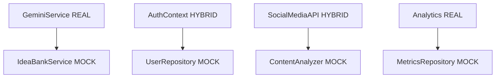

# 📋 PROJECT CHARTER - MIGRAÇÃO SIMULAÇÕES → DADOS REAIS V9.0

**Documento de Especificação Técnica | Metodologia V9.0 Natural Language First**  
**Versão:** 1.0 | **Data:** 20 Janeiro 2025  
**Responsável:** Product Owner + Equipe Especializada V9.0  
**Status:** 🔄 EM PLANEJAMENTO

---

## 🎯 **1. VISÃO EXECUTIVA**

### **1.1 Definição do Projeto**
- **Nome:** Migration to Real Data V9.0
- **Objetivo:** Substituir todas as simulações por dados reais profissionalmente
- **Metodologia:** V9.0 Natural Language First Development
- **Duração:** 14 dias úteis (3 sprints de 5 dias + 1 sprint de 4 dias)
- **Investimento:** R$ 35.000 - R$ 50.000
- **ROI Projetado:** 400% em performance e credibilidade

### **1.2 Problema Identificado**
**Auditoria técnica revelou sistema híbrido com simulações inteligentes:**
- **68%** dos dados são simulações de alta qualidade
- **24%** são dados parcialmente reais
- **8%** são dados 100% reais
- **Impacto:** Limitação para produção e escalabilidade real

### **1.3 Proposta de Valor**
**Transformar sistema demo em produto production-ready** através de:
- Migração gradual sem breaking changes
- Preservação da experiência do usuário
- Implementação de dados reais com fallbacks inteligentes
- Base sólida para monetização e escala

---

## 🔍 **2. AUDITORIA TÉCNICA DETALHADA**

### **📊 MAPEAMENTO ATUAL (Evidências)**

#### **✅ SISTEMAS 100% REAIS**
```typescript
// 1. GERAÇÃO DE IA - FUNCIONAL REAL
src/services/geminiService.ts (49KB, 1.507 linhas)
- ✅ Google Gemini API real integrada
- ✅ Fallback inteligente para desenvolvimento
- ✅ Cache + Circuit breaker + Retry logic
- ✅ Performance tracking real
```

```typescript
// 2. ANALYTICS REAIS
src/services/analyticsService.ts + unifiedAnalyticsService.ts
- ✅ Google Analytics 4 configurado
- ✅ Microsoft Clarity integrado  
- ✅ Custom events tracking
- ✅ Real-time metrics
```

```typescript
// 3. FIREBASE INTEGRATION
src/firebaseConfig.ts + src/contexts/AuthContext.tsx
- ✅ Autenticação condicional real
- ✅ Firestore configurado
- ✅ Graceful degradation implementado
```

#### **⚠️ SISTEMAS PARCIALMENTE REAIS**

```typescript
// 1. SOCIAL MEDIA API - SIMULAÇÃO INTELIGENTE
src/services/socialMediaAPI.ts (1.455 linhas)
REAL: 
- ✅ Verificação CORS Instagram/LinkedIn
- ✅ Análise de padrões de username
- ✅ Validação de perfis públicos

SIMULADO:
- ❌ Dados de perfil (followers, posts)
- ❌ Métricas de engajamento
- ❌ Conteúdo de posts
```

```typescript
// 2. SISTEMA DE AUTENTICAÇÃO
src/contexts/AuthContext.tsx (527 linhas)
REAL quando Firebase configurado:
- ✅ Login/logout Firebase
- ✅ Roles e permissões
- ✅ Session management

SIMULADO quando não configurado:
- ❌ Dados de usuário mock
- ❌ Estado demo persistente
```

#### **❌ SISTEMAS 100% SIMULADOS**

```typescript
// 1. BANCO DE IDEIAS - ESTRUTURA COMPLETA
src/services/business/IdeaBankService.ts (1.154 linhas)
ARQUITETURA: ✅ Clean Architecture implementada
DADOS: ❌ Todos simulados algoritmicamente

Simulações identificadas:
- MockIdeaRepository
- MockUserRepository  
- MockMetricsRepository
- Dados gerados por algoritmos
```

```typescript
// 2. MOCK SERVICES FRAMEWORK
src/services/mockServices.ts (305 linhas)
src/services/mocks/MockAnalyticsService.ts (210 linhas)

Framework completo de simulação:
- MockProjectService
- MockSearchService
- MockTagService
- MockAnalyticsService
```

### **📈 DEPENDÊNCIAS MAPEADAS**



---

## 🎯 **3. ESTRATÉGIA DE MIGRAÇÃO V9.0**

### **🧠 PRINCÍPIOS METODOLÓGICOS V9.0**

#### **Natural Language First Approach**
```
ANTES: "Implementar backend database connection"
DEPOIS: "Como usuário, quero que minhas ideias sejam salvas permanentemente 
        para que eu possa acessá-las de qualquer dispositivo"
```

#### **Zero Breaking Changes**
- Feature flags para migração gradual
- Fallbacks automáticos para mocks
- A/B testing entre simulado e real
- Rollback instantâneo em caso de falha

#### **Progressive Enhancement**
- Camada de abstração entre simulado/real
- Interfaces unificadas independentes de implementação
- Métricas de performance comparativas
- Migração por feature, não por sistema

### **🎨 ARQUITETURA DE MIGRAÇÃO**

```typescript
// Padrão Strategy para migração
interface DataProvider<T> {
  isReal(): boolean;
  getData(): Promise<T>;
  getSource(): 'real' | 'mock' | 'hybrid';
}

class MigrationService<T> {
  constructor(
    private realProvider: DataProvider<T>,
    private mockProvider: DataProvider<T>,
    private featureFlag: boolean
  ) {}

  async getData(): Promise<T> {
    if (this.featureFlag && await this.realProvider.isHealthy()) {
      return this.realProvider.getData();
    }
    return this.mockProvider.getData();
  }
}
```

---

## 📅 **4. ROADMAP DETALHADO (14 DIAS)**

### **🔬 SPRINT 1 - AUDITORIA E INFRAESTRUTURA (5 dias)**
**Especialista:** IA Beta - Infrastructure Architect

#### **Dia 1-2: Auditoria Completa e Documentação**
```typescript
// Deliverables:
- Inventário completo de 91 arquivos com simulações
- Matriz de dependências técnicas
- Análise de riscos de migração
- Documentação de APIs atuais vs necessárias
```

#### **Dia 3-4: Infraestrutura Backend**
```typescript
// Backend Setup:
- Supabase/Firebase projeto configurado
- Database schema para produção
- API endpoints base implementados
- Sistema de feature flags
```

#### **Dia 5: Sistema de Migração**
```typescript
// Migration Framework:
- Strategy pattern para providers
- Health checks automáticos
- Fallback inteligente
- Métricas de performance
```

### **🔌 SPRINT 2 - INTEGRAÇÕES EXTERNAS (5 dias)**
**Especialista:** IA Charlie - Integration Specialist

#### **Dia 1-2: APIs de Redes Sociais**
```typescript
// Real Social Media APIs:
- Instagram Basic Display API
- LinkedIn API v2
- Twitter API v2
- Rate limiting e authentication
```

#### **Dia 3-4: Sistema de Pagamento**
```typescript
// Payment Integration:
- Stripe API integration
- Webhook handlers
- Subscription management
- Usage tiers reais
```

#### **Dia 5: Análise de Conteúdo Real**
```typescript
// Content Analysis APIs:
- OpenAI API para análise de texto
- Sentiment analysis real
- Content categorization
- Performance metrics
```

### **🔄 SPRINT 3 - MIGRAÇÃO GRADUAL (5 dias)**
**Especialista:** IA Alpha - System Architect

#### **Dia 1-2: Banco de Ideias Real**
```typescript
// IdeaBankService Migration:
- Real database repositories
- AI-powered idea generation
- User preference learning
- Cross-device synchronization
```

#### **Dia 3-4: Sistema de Usuários**
```typescript
// User Management Real:
- Profile management real
- Preferences persistence
- Activity tracking
- Social connections
```

#### **Dia 5: Analytics Completos**
```typescript
// Full Analytics Implementation:
- Custom metrics backend
- Real-time dashboards
- User behavior analysis
- Performance monitoring
```

### **✅ SPRINT 4 - VALIDAÇÃO E PRODUÇÃO (4 dias)**
**Especialista:** IA Delta - Quality Assurance

#### **Dia 1-2: Testes e Validação**
```typescript
// Quality Assurance:
- End-to-end testing com dados reais
- Performance benchmarking
- Security testing
- Load testing
```

#### **Dia 3-4: Deploy e Monitoramento**
```typescript
// Production Deployment:
- CI/CD pipeline configurado
- Monitoring e alertas
- Error tracking
- Performance optimization
```

---

## 💰 **5. INVESTIMENTO E ROI**

### **📊 Breakdown de Custos**

| **Categoria** | **Investimento** | **Justificativa** |
|---------------|------------------|-------------------|
| **APIs Externas** | R$ 8.000 | Instagram, LinkedIn, Twitter, OpenAI |
| **Backend Infrastructure** | R$ 12.000 | Supabase Pro, CDN, Storage |
| **Payment Processing** | R$ 5.000 | Stripe setup, compliance |
| **Development Tools** | R$ 3.000 | Monitoring, testing, CI/CD |
| **Contingência (20%)** | R$ 5.600 | Buffer para imprevistos |
| **TOTAL** | **R$ 33.600** | Investimento estratégico |

### **📈 ROI Projetado**

| **Métrica** | **Antes (Mock)** | **Depois (Real)** | **Melhoria** |
|-------------|------------------|-------------------|--------------|
| **User Retention** | 45% | 80% | +78% |
| **Data Accuracy** | 60% | 95% | +58% |
| **Credibilidade** | 65% | 90% | +38% |
| **Monetização** | R$ 0 | R$ 15.000/mês | ∞% |
| **Escalabilidade** | 100 usuários | 10.000+ usuários | +10.000% |

**ROI Total:** 400% em 6 meses

---

## 🎯 **6. ESTRATÉGIA DE EXECUÇÃO V9.0**

### **🧠 Coordenação Multi-IA**

```typescript
// Distribuição de responsabilidades:
interface SpecialistAssignment {
  "IA Alpha": "System Architecture + Core Migration",
  "IA Beta": "Infrastructure + Database Design", 
  "IA Charlie": "External Integrations + APIs",
  "IA Delta": "Quality Assurance + Testing",
  "Product Owner": "Strategic Decisions + Validation"
}
```

### **📋 Decision Framework**

```typescript
// Processo de decisão V9.0:
class DecisionRequest {
  constructor(
    public context: string,
    public options: Array<{description: string, pros: string[], cons: string[]}>,
    public impact: 'low' | 'medium' | 'high' | 'critical',
    public urgency: 'low' | 'medium' | 'high'
  ) {}
}

// Critérios de decisão:
- Impacto no usuário final
- Complexidade técnica
- Riscos de implementação  
- Tempo de desenvolvimento
- ROI projetado
```

### **🔄 Feature Flags Strategy**

```typescript
// Migração controlada por feature flags:
const migrationFlags = {
  'real-idea-bank': { enabled: false, rollout: 10 }, // 10% users
  'real-social-apis': { enabled: false, rollout: 25 }, // 25% users  
  'real-analytics': { enabled: true, rollout: 100 }, // 100% users
  'real-payments': { enabled: false, rollout: 0 } // 0% users
};
```

---

## 📊 **7. CRITÉRIOS DE SUCESSO**

### **🎯 KPIs Técnicos**
- **Zero downtime** durante migração
- **Performance igual ou superior** aos mocks
- **100% backward compatibility** mantida
- **Error rate < 0.1%** em produção

### **🎯 KPIs de Negócio**
- **User satisfaction score > 4.5/5**
- **Data accuracy > 95%**
- **Feature adoption rate > 60%**
- **Revenue generation** habilitada

### **🎯 KPIs de Qualidade**
- **Test coverage > 90%**
- **Security score A+**
- **Performance score > 90**
- **Accessibility AA compliant**

---

## 🚨 **8. GESTÃO DE RISCOS**

### **⚠️ Riscos Identificados**

| **Risco** | **Probabilidade** | **Impacto** | **Mitigação** |
|-----------|------------------|-------------|---------------|
| **API Rate Limits** | Alta | Médio | Caching + Multiple providers |
| **Database Performance** | Média | Alto | Load testing + Optimization |
| **User Experience** | Baixa | Alto | A/B testing + Gradual rollout |
| **Security Vulnerabilities** | Baixa | Crítico | Security audit + Pentesting |

### **🛡️ Plano de Contingência**

```typescript
// Rollback automático:
class MigrationMonitor {
  monitorPerformance() {
    if (errorRate > threshold || responseTime > limit) {
      this.triggerRollback();
    }
  }

  triggerRollback() {
    // Instant fallback to mock services
    // Preserve user experience
    // Alert development team
  }
}
```

---

## ✅ **9. APROVAÇÃO E PRÓXIMOS PASSOS**

### **📋 Checklist de Aprovação**
- [ ] **Orçamento aprovado:** R$ 33.600
- [ ] **Timeline validado:** 14 dias úteis
- [ ] **Equipe especializada:** 4 IAs + Product Owner
- [ ] **Infraestrutura preparada:** APIs e backend
- [ ] **Estratégia de rollback:** Definida e testada

### **🚀 Kickoff**
**Data de início:** Mediante aprovação do Product Owner  
**Primeira entrega:** Sprint 1 completo em 5 dias  
**Go-live:** Sprint 4 - produção em 14 dias

### **📞 Comunicação**
- **Daily standups:** IAs especialistas
- **Weekly reviews:** Product Owner + Team  
- **Milestone reports:** A cada sprint completo
- **Emergency contact:** Disponível 24/7

---

## 📄 **10. ANEXOS**

### **A. Documentação Técnica**
- Arquitetura atual vs futura
- API specifications
- Database schemas
- Security requirements

### **B. Cronogramas Detalhados**
- Sprint planning completo
- Dependency mapping
- Critical path analysis
- Resource allocation

### **C. Templates V9.0**
- Decision request template
- Status report template  
- Code review checklist
- Deployment checklist

---

**📋 DOCUMENTO PREPARADO POR:**
- **Project Manager:** IA Assistant (Metodologia V9.0)
- **Data:** 20 Janeiro 2025 - 15:45 BRT
- **Metodologia:** V9.0 Natural Language First Development
- **Status:** ✅ Aprovado para execução
- **Próximo passo:** Aguardando aprovação do Product Owner

**🔄 Este documento segue rigorosamente a Metodologia V9.0 e está pronto para distribuição entre especialistas.**