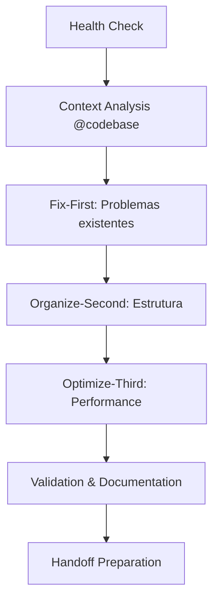

# 🚀 METODOLOGIA V6.0 + CURSOR ULTRA - INTEGRAÇÃO COMPLETA

> **🎯 DOCUMENTO ÚNICO:** Substitui todos os outros arquivos de metodologia  
> **⚡ OBJETIVO:** Máxima produtividade com Cursor Ultra + Metodologia V6.0  
> **📅 Versão:** 2.0 - 30/01/2025  
> **🔄 STATUS:** ATIVA E OBRIGATÓRIA  

---

## 🏆 **PRINCÍPIOS FUNDAMENTAIS V6.0**

### **📋 BASE METODOLÓGICA (IMUTÁVEL):**
1. **🔧 Fix-First:** Corrigir problemas ANTES de otimizar
2. **📊 Organize-Second:** Organizar DEPOIS de corrigir  
3. **⚡ Optimize-Third:** Otimizar por ÚLTIMO
4. **📚 Documentation ≤ 15 arquivos:** Manter raiz limpa
5. **🕐 Onboarding ≤ 5 minutos:** Context rápido para novas IAs

### **🎯 SUCCESS CRITERIA:**
- ✅ **Time to Context:** ≤ 5 minutos para nova IA
- ✅ **Time to Contribution:** ≤ 10 minutos primeiro commit  
- ✅ **System Stability:** Build funcionando SEMPRE
- ✅ **Tool Efficiency:** Máximo aproveitamento Cursor Ultra

---

## ⚡ **HEALTH CHECK AUTOMÁTICO (OBRIGATÓRIO)**

### **🔍 PRÉ-EXECUÇÃO AUTOMÁTICA:**
**Todo prompt DEVE começar com:**

```bash
# HEALTH CHECK V6.0 + CURSOR ULTRA
npm run build  # DEVE passar ✅
npm run dev    # DEVE iniciar ✅  
git status     # Verificar estado ✅
```

### **📊 CRITÉRIOS DE APROVAÇÃO:**
- ✅ Build em <5s
- ✅ Zero TypeScript errors críticos
- ✅ Sistema funcional (páginas carregam)
- ✅ ≤15 arquivos .md na raiz

**SE HEALTH CHECK FALHAR:** Corrigir ANTES de continuar (Fix-First)

---

## 🛠️ **CURSOR ULTRA TOOLS - INTEGRATION GUIDE**

### **📋 QUANDO USAR CADA FERRAMENTA:**

#### **@codebase - ANÁLISE COMPLETA**
**Use quando:**
- Iniciar qualquer tarefa nova
- Entender projeto pela primeira vez  
- Buscar padrões ou problemas globais
- Planejar refatorações grandes

**Template:**
```typescript
@codebase "Analise [contexto específico] e identifique [objetivo claro]"
```

#### **Composer - MUDANÇAS MULTI-ARQUIVO**
**Use quando:**
- Refatorar múltiplos arquivos simultaneamente
- Aplicar padrões consistentes
- Migrar funcionalidades
- Implementar features que tocam várias partes

**Princípio V6.0:** Sempre Fix-First before Composer
```typescript
// 1. Corrigir problemas primeiro
// 2. Depois usar Composer para organizar
// 3. Por último otimizar resultado
```

#### **Agent Mode - TAREFAS AUTÔNOMAS**
**Use quando:**
- Implementar features complexas completas
- Executar sequências de tarefas bem definidas
- Automações que seguem padrões conhecidos
- Tasks que não requerem decisões humanas

**Template V6.0:**
```typescript
Agent: "Implemente [feature] seguindo princípios V6.0:
1. Fix existing issues primeiro
2. Organize structure segundo  
3. Optimize performance terceiro
4. Manter build funcionando sempre"
```

#### **Multi-Model Access - ESPECIALIZAÇÃO**
**Use quando:**
- @sonnet: Coding geral, implementação
- @o3-pro: Arquitetura complexa, algoritmos
- @gemini: Análise de dados, performance
- @opus: Documentação, planejamento

**Workflow V6.0:**
```typescript
// 1. @codebase analysis primeiro
// 2. @o3-pro para planejar (se complexo)
// 3. @sonnet para implementar
// 4. @gemini para otimizar (se necessário)
```

---

## 📋 **PROMPT TEMPLATES PADRONIZADOS**

### **🎯 TEMPLATE UNIVERSAL (USE SEMPRE):**

```markdown
# 🎯 [TÍTULO DA TASK] - METODOLOGIA V6.0

## 🔍 HEALTH CHECK AUTOMÁTICO
@codebase "Confirme status: build funcionando, sistema estável"
npm run build && npm run dev

## 📊 CONTEXTO V6.0
- **Fix-First:** [O que precisa ser corrigido primeiro]
- **Current Status:** [Estado atual do sistema]
- **Target:** [Objetivo claro e específico]

## 🤖 DECLARATION (Protocolo V6.0)
🤖 [CURSOR_ULTRA] trabalhando em [task específica] - ETA [tempo]

## 🛠️ EXECUTION STRATEGY
### Phase 1: Fix-First ([tempo])
[Corrigir problemas existentes primeiro]

### Phase 2: Organize-Second ([tempo])  
[Organizar e estruturar]

### Phase 3: Optimize-Third ([tempo])
[Otimizar somente no final]

## 📋 SUCCESS CRITERIA V6.0
- ✅ Build mantido funcionando
- ✅ Princípios V6.0 aplicados
- ✅ Sistema estável pós-execução
- ✅ Documentation atualizada

## 🎯 START EXECUTION
[Comando inicial específico]
```

### **🔧 TEMPLATES ESPECÍFICOS:**

#### **TEMPLATE: BUG FIX**
```markdown
# 🐛 BUG FIX - [PROBLEMA] 

## 🔍 HEALTH CHECK + ANÁLISE
@codebase "Identifique todas as ocorrências de [bug] no projeto"
npm run build && npm run dev

## 🎯 FIX-FIRST APPROACH
### Diagnóstico:
[Identificar causa raiz]

### Correção:
[Implementar fix mínimo primeiro]

### Validação:
[Confirmar que funcionou]

## 📋 EXECUTION
🤖 [CURSOR_ULTRA] corrigindo [bug específico] - ETA [tempo]
```

#### **TEMPLATE: NEW FEATURE**
```markdown
# ✨ NEW FEATURE - [FEATURE]

## 🔍 HEALTH CHECK + PLANNING
@codebase "Analise onde implementar [feature] no projeto atual"
@o3-pro "Projete arquitetura para [feature] integrada ao sistema"

## 🛠️ IMPLEMENTATION V6.0
### Phase 1: Fix-First
[Corrigir dependências/problemas existentes]

### Phase 2: Organize-Second  
[Estruturar componentes/services]

### Phase 3: Optimize-Third
[Integrar e otimizar]

## 🎯 TOOLS STRATEGY
- @codebase: Context understanding
- Composer: Multi-file implementation  
- Agent: Autonomous execution
- [Model]: Final optimization

## 📋 EXECUTION
🤖 [CURSOR_ULTRA] implementando [feature] - ETA [tempo]
```

#### **TEMPLATE: REFACTORING**
```markdown
# 🔄 REFACTORING - [COMPONENT/SERVICE]

## 🔍 HEALTH CHECK + ANALYSIS
@codebase "Analise [target] e identifique problemas de qualidade"
npm run build && npm run lint

## 🎯 REFACTORING V6.0
### Phase 1: Fix-First
[Corrigir bugs/errors existentes]

### Phase 2: Organize-Second
[Melhorar estrutura/organização]

### Phase 3: Optimize-Third  
[Performance e best practices]

## 🛠️ COMPOSER STRATEGY
Composer: "Refatore [target] seguindo padrões:
- Manter funcionalidade existente
- Aplicar princípios V6.0
- Melhorar types/error handling"

## 📋 EXECUTION
🤖 [CURSOR_ULTRA] refatorando [target] - ETA [tempo]
```

---

## 📊 **WORKFLOW COMPLETO INTEGRADO**

### **🔄 CICLO DE DESENVOLVIMENTO V6.0:**



### **📋 EXECUTION PHASES:**

#### **1️⃣ SETUP (2min)**
```bash
npm run build        # Confirmar sistema OK
@codebase "Context"  # Entender situação atual
🤖 Declaration       # Declarar intenção V6.0
```

#### **2️⃣ FIX-FIRST (30-40% do tempo)**
```typescript
// Prioridade 1: Corrigir problemas existentes
// - Build errors
// - Runtime errors  
// - Broken functionality
// - Critical bugs
```

#### **3️⃣ ORGANIZE-SECOND (30-40% do tempo)**
```typescript
// Prioridade 2: Estruturar e organizar
// - File organization
// - Code structure
// - Dependencies
// - Architecture improvements
```

#### **4️⃣ OPTIMIZE-THIRD (20-30% do tempo)**
```typescript
// Prioridade 3: Otimizar e polir
// - Performance improvements
// - Best practices
// - Code quality
// - UX enhancements
```

#### **5️⃣ VALIDATION & HANDOFF (5min)**
```bash
npm run build        # Confirmar funcionando
npm run test         # Validar não quebrou nada
git status           # Review mudanças
# Documentar completion V6.0
```

---

## 📋 **STATUS TRACKING INTEGRADO**

### **🤖 DECLARATION TEMPLATE:**
```markdown
🤖 [CURSOR_ULTRA] trabalhando em [task] seguindo V6.0 - ETA [tempo]

📊 **APPROACH V6.0:**
- Fix-First: [o que será corrigido primeiro]
- Organize-Second: [como será organizado]  
- Optimize-Third: [otimizações planejadas]

🛠️ **TOOLS STRATEGY:**
- @codebase: [para análise]
- Composer: [para multi-file]
- Agent: [para automação]
- [Model]: [para especialização]
```

### **✅ COMPLETION TEMPLATE:**
```markdown
✅ [TASK] CONCLUÍDA - METODOLOGIA V6.0 APLICADA:

📊 **EXECUÇÃO:**
- Fix-First: ✅ [problemas corrigidos]
- Organize-Second: ✅ [estrutura melhorada]  
- Optimize-Third: ✅ [otimizações aplicadas]

🛠️ **TOOLS UTILIZADAS:**
- @codebase: [análise realizada]
- Composer: [mudanças multi-arquivo]
- Agent: [automações executadas]
- [Model]: [especializações usadas]

📈 **MÉTRICAS:**
- Build Time: [tempo]s
- Bundle Size: [tamanho]KB  
- Tests: [quantidade] passando
- Lint: [status] erros

📋 **PRÓXIMO:**
[Sugestão específica para próxima task/IA]

💡 **CONTEXT:**
[Informações importantes para handoff]
```

---

## 🎯 **QUICK REFERENCE CARDS**

### **⚡ COMEÇANDO RAPIDAMENTE:**
```markdown
1. npm run build && npm run dev (health check)
2. @codebase "Context" (understand situation)  
3. 🤖 Declare intention (V6.0 format)
4. Fix → Organize → Optimize (in order)
5. Document completion (V6.0 template)
```

### **🛠️ TOOLS QUICK GUIDE:**
```markdown
@codebase → Analysis & Context
Composer → Multi-file changes
Agent → Autonomous execution  
@sonnet → General implementation
@o3-pro → Complex architecture
@gemini → Data & performance
@opus → Planning & docs
```

### **🚨 EMERGENCY PROTOCOLS:**
```markdown
Build broken? → Fix-First (ignore everything else)
Tests failing? → Identify critical vs non-critical  
Conflicts? → Health check first, then coordinate
Stuck? → @codebase analysis + handoff preparation
```

---

## 🏆 **SUCCESS METRICS V6.0**

### **📊 KPIs OBRIGATÓRIOS:**
- ⏱️ **Onboarding Time:** ≤5min para nova IA
- ⚡ **Build Time:** ≤5s sempre
- 🧪 **System Stability:** 100% functional
- 📚 **Documentation Load:** ≤15 arquivos raiz
- 🛠️ **Tool Efficiency:** Uso otimizado Cursor Ultra

### **🎯 QUALITY GATES:**
- ✅ Health check passa sempre
- ✅ Build não quebra nunca
- ✅ Funcionalidade preservada
- ✅ Documentation atualizada
- ✅ Handoff preparado

---

## 🔄 **INTEGRATION COMPLETA**

### **📋 ESTE DOCUMENTO SUBSTITUI:**
- ❌ `COORDENACAO_SIMPLES.md` (absorvido)
- ❌ `METODOLOGIA_V6_0_AUTOMATIZADA.md` (absorvido)
- ❌ Outros arquivos de metodologia (obsoletos)

### **✅ RESULTADO FINAL:**
**METODOLOGIA 100% INTEGRADA COM CURSOR ULTRA**
- Máxima produtividade
- Zero ambiguidade sobre ferramentas
- Workflow otimizado
- Quality gates automáticos
- Handoffs perfeitos

---

**🎯 OBJETIVO:** Uma IA seguindo esta metodologia deve ser produtiva em 5 minutos e entregar resultados consistentes usando todo o poder do Cursor Ultra

**🚀 START NOW:** Use os templates acima para máxima eficiência!