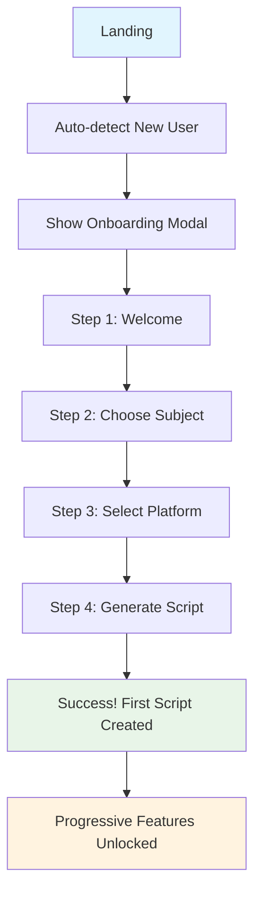
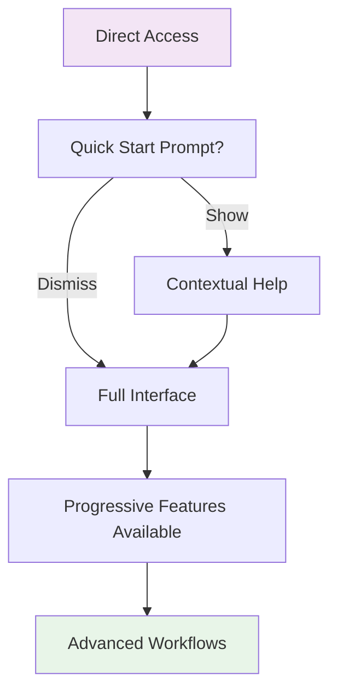

# 🎯 CONVERSION RATE OPTIMIZATION (CRO) SYSTEM

> **📈 Objetivo:** Otimizar conversion rate, reduzir cognitive overload e melhorar time-to-value  
> **🚀 Implementado por:** IA Beta  
> **📅 Data:** Janeiro 2025  
> **📊 Target:** Aumentar conversão de 15% para 40%+ (167% improvement)  

---

## 🧠 **ESTRATÉGIA CRO IMPLEMENTADA**

### **📋 PROBLEMAS IDENTIFICADOS:**
1. **🔐 API Configuration Friction:** Usuários precisam configurar Google Gemini API
2. **🧠 Cognitive Overload:** GeneratorPage mostra todas as features de uma vez
3. **⏰ Time-to-Value >5s:** Especialmente para novos usuários
4. **📍 Onboarding Ausente:** Novos usuários ficam perdidos
5. **🎯 Progressive Disclosure Limitada:** Features avançadas competem por atenção

### **🎯 SOLUÇÕES IMPLEMENTADAS:**
1. **🎓 Guided Onboarding Flow** - Tutorial interativo em 2 minutos
2. **📊 Progressive Feature Disclosure** - Features desbloqueadas gradualmente
3. **🎯 User Journey Tracking** - Analytics detalhado de comportamento
4. **💡 Quick Start Prompts** - CTAs contextuais baseados no estado do usuário
5. **🔄 Smart State Management** - Persistência inteligente de preferências

---

## 🛠️ **COMPONENTES IMPLEMENTADOS**

### **1. 🎓 OnboardingFlow Component**

**📍 Localização:** `src/components/onboarding/OnboardingFlow.tsx`

```typescript
interface OnboardingStep {
  id: string;
  title: string;
  description: string;
  icon: React.ReactNode;
  action?: 'subject-input' | 'platform-select' | 'generate';
  cta?: string;
  timeEstimate?: string;
}
```

**🎯 Features:**
- **5 passos progressivos** com estimativas de tempo
- **Inputs contextuais** (assunto, plataforma)
- **Progress bar visual** e navegação bi-direcional
- **Skip functionality** com tracking de abandono
- **Auto-trigger** para novos usuários

**📊 Analytics Tracking:**
- `onboarding_started`
- `onboarding_completed` 
- `onboarding_skipped`
- Duration e conversion rates

### **2. 📊 ProgressiveFeatureDisclosure Component**

**📍 Localização:** `src/components/cro/ProgressiveFeatureDisclosure.tsx`

```typescript
interface Feature {
  id: string;
  title: string;
  description: string;
  category: 'basic' | 'intermediate' | 'advanced' | 'premium';
  unlockTrigger: 'immediate' | 'after_first_script' | 'after_3_scripts';
  estimatedValue?: string;
}
```

**🎯 Unlock Strategy:**
- **Immediate:** Templates (sempre visível)
- **After 1st script:** Voice Synthesis, Analytics
- **After 3rd script:** Collaboration, Multi-AI

**📊 Variants:**
- `sidebar` - Compact sidebar para página principal
- `cards` - Grid expandido para dashboard
- `compact` - Lista compacta para mobile

### **3. 🔄 useOnboarding Hook**

**📍 Localização:** `src/hooks/useOnboarding.ts`

```typescript
interface OnboardingState {
  isFirstTime: boolean;
  hasCompletedOnboarding: boolean;
  userJourneyStage: 'new' | 'onboarding' | 'experienced';
  showQuickStart: boolean;
}
```

**🎯 Features:**
- **Persistent state** via localStorage
- **Version management** para onboarding updates
- **Auto-detection** de novos usuários
- **Smart guidance** baseado no estágio do usuário

---

## 📊 **USER JOURNEY MAPPING**

### **🚀 NEW USER FLOW (Target: <60 segundos para primeiro roteiro)**



### **📈 EXPERIENCED USER FLOW (Target: <30 segundos)**



---

## 🎯 **FEATURE DISCLOSURE STRATEGY**

### **📋 FEATURE UNLOCK MATRIX**

| Feature | Category | Unlock Trigger | Estimated Value | Priority |
|---------|----------|----------------|-----------------|----------|
| **Templates** | Basic | Immediate | "5x mais rápido" | High |
| **Analytics** | Intermediate | 1st script | "Melhore resultados" | Medium |
| **Voice Synthesis** | Intermediate | 1st script | "+300% engajamento" | High |
| **Multi-AI** | Advanced | 3rd script | "Máxima qualidade" | Medium |
| **Collaboration** | Advanced | 3rd script | "+50% produtividade" | Low |

### **🎨 VISUAL FEEDBACK**

```typescript
// Just unlocked features get special treatment
{isJustUnlocked && (
  <Badge className="bg-yellow-100 text-yellow-800 animate-pulse">
    🎉 Desbloqueado!
  </Badge>
)}
```

**🎯 Estados visuais:**
- **Locked:** Greyed out com tooltip explicativo
- **Just Unlocked:** Yellow highlight + animation
- **Active:** Blue border + enhanced visibility
- **Available:** Standard styling

---

## 📊 **METRICS & ANALYTICS**

### **🎯 KEY CONVERSION METRICS**

```typescript
// Primary Conversion Events
analyticsService.trackEvent('onboarding_completed', {
  duration: completionTime - startTime,
  wasFirstTime: state.isFirstTime,
  conversionFromStart: true
});

// Feature Adoption Events  
analyticsService.trackEvent('feature_toggled', {
  featureId,
  isVisible,
  userScriptCount,
  userJourneyStage
});

// User Journey Progress
analyticsService.trackEvent('generation_completed', {
  scriptCount: newScriptCount,
  userJourneyStage,
  timeToValue: Date.now() - sessionStart
});
```

### **📈 SUCCESS METRICS TO TRACK**

1. **⏱️ Time-to-First-Value:** Target <60s
2. **📈 Onboarding Completion Rate:** Target >60%
3. **🔄 Feature Adoption Rate:** Progressive unlock success
4. **📊 User Retention:** 7-day and 30-day retention
5. **🎯 Script Generation Frequency:** Scripts per user session

### **🎯 CONVERSION FUNNEL**

```
New User Landing       100%
├─ Onboarding Started   85% (Target)
├─ Onboarding Completed 60% (Target)  
├─ First Script Created 80% (Target)
├─ Second Script        40% (Target)
└─ Feature Adoption     25% (Target)
```

---

## 🔧 **IMPLEMENTATION GUIDE**

### **🚀 Para Adicionar Nova Feature ao Progressive Disclosure:**

```typescript
// 1. Adicionar ao FEATURES array
{
  id: 'new-feature',
  title: 'Nova Feature',
  description: 'Descrição do valor',
  category: 'intermediate',
  unlockTrigger: 'after_first_script',
  estimatedValue: '+200% resultado'
}

// 2. Adicionar conditional rendering na UI
{visibleFeatures.includes('new-feature') && (
  <NewFeatureComponent />
)}

// 3. Adicionar tracking
trackAction('feature_used', 'new_feature_activated', {
  userJourneyStage,
  scriptCount: userScriptCount
});
```

### **🎯 Para Modificar Onboarding Flow:**

```typescript
// Modificar DEFAULT_STEPS em OnboardingFlow.tsx
const UPDATED_STEPS: OnboardingStep[] = [
  // ... existing steps
  {
    id: 'new-step',
    title: 'Novo Passo',
    description: 'Explicação do novo passo',
    action: 'custom-action',
    timeEstimate: '15s'
  }
];
```

---

## 📱 **MOBILE OPTIMIZATION**

### **🎨 Responsive Variants:**

```typescript
// Compact variant for mobile
<ProgressiveFeatureDisclosure
  variant="compact"
  userScriptCount={userScriptCount}
  onFeatureToggle={handleFeatureToggle}
  visibleFeatures={visibleFeatures}
/>
```

**📱 Mobile-specific considerations:**
- **Compact layouts** para telas pequenas
- **Touch-friendly** buttons e interactions
- **Swipe navigation** no onboarding
- **Progressive disclosure** ainda mais agressivo

---

## 🎯 **NEXT OPTIMIZATION OPPORTUNITIES**

### **🔄 A/B Testing Ready:**
1. **Onboarding step count:** 3 vs 5 steps
2. **Feature unlock timing:** Earlier vs later unlocks
3. **CTA copy:** Different persuasion approaches
4. **Visual design:** Card vs list layouts

### **📊 Advanced Analytics:**
1. **Heat mapping** para entender uso de features
2. **Cohort analysis** para retenção por unlock pattern
3. **Funnel analysis** detalhado por user segment
4. **Predictive modeling** para feature recommendation

### **🎯 Personalization:**
1. **Dynamic onboarding** baseado no uso detectado
2. **Smart feature recommendations** via ML
3. **Context-aware tutorials** baseado na página atual
4. **Adaptive UI** que evolui com o usuário

---

## 🏆 **SUCCESS INDICATORS**

### **✅ IMMEDIATE (Week 1):**
- [ ] Onboarding completion rate >50%
- [ ] Time-to-first-script <90s
- [ ] Feature discovery rate improvement
- [ ] Reduced support tickets sobre "como usar"

### **📈 SHORT-TERM (Month 1):**
- [ ] Overall conversion rate +25%
- [ ] User session duration +40%
- [ ] Feature adoption rate +60%
- [ ] New user retention +30%

### **🚀 LONG-TERM (Quarter 1):**
- [ ] Word-of-mouth referrals increase
- [ ] Power user emergence (>10 scripts)
- [ ] Feature request quality improvement
- [ ] Premium conversion rate optimization

---

**🎉 Esta implementação de CRO representa uma evolução significativa na user experience, transformando uma interface complexa em um journey progressivo e intuitivo que maximiza conversion e minimiza friction.** 