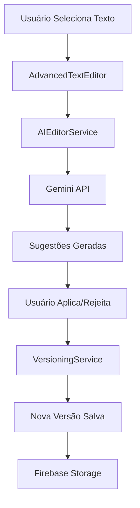

# 📝 **ESPECIFICAÇÕES TÉCNICAS - FASE 2: EDITOR AVANÇADO COM IA**

> **Status:** ✅ **IMPLEMENTADA**  
> **Versão:** 2.0.0  
> **Data:** Janeiro 2025  
> **Responsável:** Sistema Roteirar IA

---

## 🎯 **VISÃO GERAL**

A **Fase 2** introduce um editor de texto avançado com inteligência artificial integrada, permitindo seleção granular de texto, refinamento automático, controle de versões e comparação de mudanças. Este editor transforma a experiência de criação de roteiros em um processo assistido por IA.

### **Principais Funcionalidades**
- 🔍 **Seleção Granular** - Selecione qualquer parte do texto para refinamento
- 🤖 **Refinamento com IA** - 7 tipos diferentes de melhorias automáticas
- 📚 **Controle de Versões** - Histórico completo com auto-save
- 📊 **Comparação de Versões** - Visualização lado a lado das mudanças
- ⚡ **Sugestões Contextuais** - IA sugere melhorias em tempo real
- 🎨 **Interface Moderna** - Editor profissional com toolbar intuitivo

---

## 🏗️ **ARQUITETURA TÉCNICA**

### **Componentes Principais**

```
src/components/editor/
├── AdvancedTextEditor.tsx      # 🎯 Componente principal do editor
├── AIRefinementModal.tsx       # 🤖 Modal de refinamento com IA
├── VersionHistoryModal.tsx     # 📚 Modal de histórico de versões
└── ComparisonModal.tsx         # 📊 Modal de comparação de versões

src/services/
├── aiEditorService.ts          # 🤖 Serviço de IA para editor
└── versioningService.ts        # 📚 Serviço de controle de versões

src/types.ts                    # ✨ Tipos expandidos para Fase 2
```

### **Fluxo de Dados**



---

## 🎨 **ESPECIFICAÇÕES DE UI/UX**

### **Editor Principal (AdvancedTextEditor)**

#### **Toolbar Superior**
```typescript
// Funcionalidades da Toolbar
- 🔤 Seleção Ativa: Mostra caracteres selecionados
- ⚡ Botões Rápidos: Melhorar, Clareza, Engajamento
- 🔧 Refinamento Avançado: Modal completo de configuração
- 📊 Status: Indicadores de processamento e salvamento
- 📈 Estatísticas: Contagem de palavras em tempo real
- 📚 Controles: Histórico, Comparação, Salvar
```

#### **Área de Edição**
```typescript
// Características do Editor
- 📝 Textarea responsiva com fonte mono
- 🎯 Seleção de texto intuitiva
- ⌨️ Atalhos de teclado (Ctrl+S, Ctrl+Shift+I)
- 💾 Auto-save configurável (30s padrão)
- 🎨 Tema dark/light automático
```

#### **Painel de Sugestões**
```typescript
// Sugestões Laterais
- 📍 Posicionamento: Canto superior direito
- 📦 Limite: 3 sugestões por vez
- 🎯 Confiança: Score percentual
- ⚡ Ações: Aplicar/Rejeitar
- 📝 Explicações: Detalhes das mudanças
```

### **Modal de Refinamento (AIRefinementModal)**

#### **Tabs de Navegação**
1. **⚡ Refinamento Rápido**
   - 7 tipos de refinamento em grid 3x3
   - Prompts pré-definidos para cada tipo
   - Aplicação imediata com um clique

2. **🔧 Refinamento Avançado**  
   - Seleção de tipo customizável
   - Campo de instruções detalhadas
   - Configuração específica de parâmetros

3. **🎯 Contexto**
   - Seleção de plataforma (YouTube, Instagram, etc.)
   - Configuração de público-alvo
   - Definição de tom e duração

#### **Tipos de Refinamento**
```typescript
type RefinementType = 
  | 'improve'     // ✨ Melhoria geral
  | 'clarity'     // 👁️ Maior clareza
  | 'engagement'  // ❤️ Mais engajamento  
  | 'tone'        // 🎵 Ajuste de tom
  | 'grammar'     // ✅ Correção gramatical
  | 'style'       // 🎨 Melhoria de estilo
  | 'rewrite'     // 🔄 Reescrita completa
```

### **Modal de Histórico (VersionHistoryModal)**

#### **Lista de Versões**
```typescript
// Informações por Versão
- 📅 Timestamp formatado em português
- 🔢 Número da versão sequencial  
- 💬 Comentário do usuário
- 🤖 Badges: Auto-save, IA, Atual
- 📊 Estatísticas: palavras, mudanças
- 🔍 Expansão para detalhes completos
```

#### **Filtros e Controles**
```typescript
// Opções de Filtro
- 🌟 Todas as versões
- ✋ Apenas manuais
- ⏰ Apenas auto-save

// Ações Disponíveis
- ✅ Seleção múltipla (máx 2)
- 🔄 Restaurar versão
- 📊 Comparar selecionadas
```

#### **Detalhes Expandidos**
```typescript
// Métricas Detalhadas
- 📝 Palavras e caracteres
- ⏱️ Tempo de leitura
- 😊 Análise de sentimento
- 🏷️ Sugestões de IA aplicadas
- 📋 Lista de mudanças
- 👀 Preview do conteúdo
```

### **Modal de Comparação (ComparisonModal)**

#### **Seleção de Versões**
```typescript
// Interface de Seleção
- 📋 Dropdowns com versões ordenadas
- 📅 Timestamps formatados
- 💬 Comentários como descrição
- 🔄 Auto-seleção das 2 mais recentes
```

#### **Modos de Visualização**
1. **📱 Lado a Lado**
   - Grid 2 colunas responsivo
   - Conteúdo completo de cada versão
   - Headers com metadados

2. **📄 Unificado (Inline)**
   - Diff linha por linha
   - Cores para adição/remoção/modificação
   - Numeração de linhas

#### **Análise de Métricas**
```typescript
// Estatísticas Comparativas
- 📊 Mudança em palavras/caracteres
- 📈 Score de melhoria calculado
- 🎯 Gráficos de proporção de mudanças
- 📋 Lista detalhada de alterações
```

---

## 🤖 **INTEGRAÇÃO COM GEMINI AI**

### **Serviço AIEditorService**

#### **Funcionalidades Principais**
```typescript
class AIEditorService {
  // 🎯 Refinamento de texto selecionado
  static async refineText(request: AIRefinementRequest): Promise<AISuggestion[]>
  
  // 📦 Múltiplas sugestões simultâneas
  static async getBatchSuggestions(text: string): Promise<Record<string, AISuggestion[]>>
  
  // 📊 Análise completa de conteúdo
  static async analyzeContent(text: string): Promise<ContentAnalysis>
  
  // 🎯 Sugestões baseadas em contexto
  static async getContextualSuggestions(selection: TextSelection): Promise<string[]>
}
```

#### **Prompt Engineering**
```typescript
// Prompts Especializados por Tipo
const basePrompts = {
  improve: "Melhore o texto mantendo sentido original...",
  clarity: "Torne mais claro eliminando ambiguidades...", 
  engagement: "Aumente potencial de engajamento...",
  // ... outros prompts otimizados
}

// Estrutura de Resposta JSON
{
  "suggestedText": "texto melhorado",
  "explanation": "explicação das mudanças", 
  "improvements": {
    "clarity": 85,
    "engagement": 90,
    "grammar": 95,
    "tone": 80,
    "relevance": 88
  },
  "reasoning": "justificativa detalhada",
  "alternatives": ["alt1", "alt2", "alt3"]
}
```

#### **Configurações de API**
```typescript
// Parâmetros Otimizados
generationConfig: {
  temperature: platform === 'LinkedIn' ? 0.7 : 0.8,
  topK: 40,
  topP: 0.95,
  maxOutputTokens: 2048
}

// Sistema de Retry
- 3 tentativas automáticas
- Timeout de 30 segundos  
- Backoff exponencial
```

---

## 📚 **SISTEMA DE VERSIONING**

### **Serviço VersioningService**

#### **Gestão de Versões**
```typescript
class VersioningService {
  // 💾 Criar nova versão
  static async createVersion(projectId, userId, content, comment, isAutoSave): Promise<ScriptVersion>
  
  // 📋 Listar versões do projeto
  static async getProjectVersions(projectId, limit): Promise<ScriptVersion[]>
  
  // 🔄 Restaurar versão específica
  static async restoreVersion(versionId, userId): Promise<ScriptVersion>
  
  // 📊 Comparar duas versões
  static async compareVersions(v1Id, v2Id): Promise<ComparisonData>
}
```

#### **Auto-Save Inteligente**
```typescript
// Sistema de Auto-Save
- ⏰ Intervalo: 30 segundos (configurável)
- 🔍 Detecção: Apenas se houver mudanças
- 🏷️ Marcação: Flagged como auto-save
- 🧹 Limpeza: Remove auto-saves antigos
- 🚫 Limite: Máx 50 versões por projeto
```

#### **Detecção de Mudanças**
```typescript
// Algoritmo de Diff
- 📝 Comparação linha por linha
- 🎯 Classificação: addition, deletion, modification
- 📍 Posicionamento: start/end indexes
- 🤖 Identificação: mudanças de IA vs manuais
```

### **Metadata de Versões**

#### **Cálculos Automáticos**
```typescript
interface VersionMetadata {
  wordCount: number;        // 📝 Contagem de palavras
  characterCount: number;   // 🔤 Contagem de caracteres  
  readingTime: number;      // ⏱️ Tempo de leitura (150 ppm)
  sentiment: number;        // 😊 Análise de sentimento (-1 a 1)
  keywordDensity: Record<string, number>; // 🏷️ Densidade de palavras-chave
}
```

#### **Análise de Sentimento**
```typescript
// Implementação Básica (expandível com IA)
const positiveWords = ['bom', 'ótimo', 'excelente', 'incrível', 'fantástico'];
const negativeWords = ['ruim', 'terrível', 'péssimo', 'ódio', 'triste'];

// Score: (positivas - negativas) / (positivas + negativas)
```

---

## 🔧 **TIPOS E INTERFACES**

### **Tipos Principais**

#### **Seleção de Texto**
```typescript
interface TextSelection {
  id: string;
  startIndex: number;
  endIndex: number;
  selectedText: string;
  context: string;          // Texto ao redor
  timestamp: Timestamp;
  userId: string;
}
```

#### **Request de Refinamento**
```typescript  
interface AIRefinementRequest {
  id: string;
  projectId: string;
  userId: string;
  originalText: string;
  selectedText: string;
  selectionStart: number;
  selectionEnd: number;
  refinementType: RefinementType;
  userInstructions: string;
  context: {
    platform: string;
    audience: string;
    tone: string;
    duration: number;
  };
  timestamp: Timestamp;
  status: 'pending' | 'processing' | 'completed' | 'failed';
}
```

#### **Sugestão de IA**
```typescript
interface AISuggestion {
  id: string;
  requestId: string;
  originalText: string;
  suggestedText: string;
  explanation: string;
  confidence: number;       // 0-1
  improvements: {
    clarity: number;
    engagement: number;
    grammar: number;
    tone: number;
    relevance: number;
  };
  reasoning: string;
  alternatives: string[];
  timestamp: Timestamp;
  geminiModel: string;
  tokensUsed: number;
}
```

#### **Versão de Script**
```typescript
interface ScriptVersion {
  id: string;
  projectId: string;
  userId: string;
  versionNumber: number;
  content: string;
  changes: VersionChange[];
  metadata: VersionMetadata;
  aiSuggestions: string[];  // IDs das sugestões aplicadas
  comment: string;
  isAutoSave: boolean;
  timestamp: Timestamp;
  stats: {
    improvementsApplied: number;
    aiSuggestionsUsed: number;
    manualEdits: number;
  };
}
```

### **Estados da UI**

#### **Estado do Editor**
```typescript
interface EditorUIState {
  currentSelection: TextSelection | null;
  activeModal: 'refinement' | 'comparison' | 'history' | null;
  showSuggestions: boolean;
  showVersionHistory: boolean;
  comparisonMode: boolean;
  highlightedChanges: string[];
  pendingAIRequests: string[];
  isProcessing: boolean;
  lastSaved: Timestamp | null;
  hasUnsavedChanges: boolean;
}
```

#### **Configurações do Editor**
```typescript
interface EditorConfig {
  userId: string;
  preferences: {
    autoSave: boolean;
    autoSaveInterval: number;
    aiSuggestionsEnabled: boolean;
    showVersionHistory: boolean;
    highlightChanges: boolean;
    comparisonMode: 'side-by-side' | 'inline' | 'overlay';
    aiProvider: 'gemini' | 'openai' | 'claude';
    sugestionTypes: RefinementType[];
  };
  shortcuts: Record<string, string>;
  theme: {
    fontSize: number;
    lineHeight: number;
    wordWrap: boolean;
    showLineNumbers: boolean;
    highlightCurrentLine: boolean;
  };
}
```

---

## ⚡ **FUNCIONALIDADES AVANÇADAS**

### **Atalhos de Teclado**
```typescript
// Atalhos Implementados
- Ctrl + S           // 💾 Salvar versão manual
- Ctrl + Z           // ↩️ Undo (planejado)
- Ctrl + Shift + I   // 🤖 Refinamento rápido
- Ctrl + H           // 📚 Abrir histórico
- Ctrl + D           // 📊 Comparar versões
```

### **Sugestões Contextuais**
```typescript
// Trigger Automático
- ⏱️ Delay: 1 segundo após seleção
- 📏 Mínimo: 10 caracteres selecionados
- 🎯 Baseado: contexto do projeto
- 🚫 Cancelável: nova seleção cancela anterior
```

### **Analytics do Editor**
```typescript
interface EditorAnalytics {
  userId: string;
  totalSessions: number;
  totalEditingTime: number;
  averageSessionDuration: number;
  aiInteractions: number;
  suggestionsAccepted: number;
  suggestionsRejected: number;
  acceptanceRate: number;
  favoriteImprovementTypes: Record<string, number>;
  productivityMetrics: {
    wordsPerMinute: number;
    editsPerSession: number;
    aiAssistanceRatio: number;
  };
  qualityMetrics: {
    averageImprovementScore: number;
    clarityImprovement: number;
    engagementImprovement: number;
  };
}
```

---

## 🗄️ **ESTRUTURA DE DADOS FIREBASE**

### **Coleções Criadas**

#### **ai_refinement_requests**
```json
{
  "request_id": {
    "id": "string",
    "projectId": "string",
    "userId": "string", 
    "originalText": "string",
    "selectedText": "string",
    "refinementType": "improve|clarity|engagement...",
    "userInstructions": "string",
    "context": { "platform": "string", "audience": "string" },
    "timestamp": "Timestamp",
    "status": "pending|processing|completed|failed"
  }
}
```

#### **ai_suggestions**
```json
{
  "suggestion_id": {
    "id": "string",
    "requestId": "string",
    "originalText": "string",
    "suggestedText": "string", 
    "explanation": "string",
    "confidence": "number",
    "improvements": { "clarity": 85, "engagement": 90 },
    "reasoning": "string",
    "alternatives": ["string[]"],
    "timestamp": "Timestamp",
    "geminiModel": "string",
    "tokensUsed": "number"
  }
}
```

#### **script_versions**
```json
{
  "version_id": {
    "id": "string",
    "projectId": "string",
    "userId": "string",
    "versionNumber": "number",
    "content": "string",
    "changes": [{ "type": "addition", "startIndex": 0, "endIndex": 10 }],
    "metadata": { "wordCount": 150, "sentiment": 0.3 },
    "aiSuggestions": ["suggestion_ids"],
    "comment": "string",
    "isAutoSave": "boolean",
    "timestamp": "Timestamp",
    "stats": { "improvementsApplied": 3, "manualEdits": 5 }
  }
}
```

#### **version_comparisons**
```json
{
  "comparison_id": {
    "id": "string",
    "projectId": "string", 
    "version1": "ScriptVersion",
    "version2": "ScriptVersion",
    "diff": [{ "type": "added", "content": "text", "startIndex": 0 }],
    "metrics": { "totalChanges": 10, "improvementScore": 75 },
    "timestamp": "Timestamp"
  }
}
```

#### **editor_analytics**
```json
{
  "userId": {
    "userId": "string",
    "totalSessions": "number",
    "aiInteractions": "number", 
    "suggestionsAccepted": "number",
    "acceptanceRate": "number",
    "productivityMetrics": { "wordsPerMinute": 45, "editsPerSession": 12 },
    "qualityMetrics": { "averageImprovementScore": 82 }
  }
}
```

---

## 🧪 **TESTES E VALIDAÇÃO**

### **Casos de Teste Principais**

#### **Editor de Texto**
- ✅ Seleção de texto funciona corretamente
- ✅ Auto-save ativa após mudanças
- ✅ Atalhos de teclado respondem
- ✅ Contagem de palavras atualiza em tempo real
- ✅ Estados de loading aparecem durante IA

#### **Integração com IA**
- ✅ Refinamento gera sugestões válidas
- ✅ Diferentes tipos produzem resultados distintos
- ✅ Aplicação de sugestões modifica texto corretamente
- ✅ Rejeição de sugestões funciona
- ✅ Contexto influencia qualidade das sugestões

#### **Sistema de Versões**
- ✅ Versões são criadas sequencialmente
- ✅ Auto-save funciona em intervalo correto
- ✅ Restauração funciona corretamente
- ✅ Limpeza de versões antigas executa
- ✅ Detecção de mudanças é precisa

#### **Comparação de Versões**
- ✅ Diff calcula diferenças corretamente
- ✅ Métricas são calculadas precisamente
- ✅ Visualização lado a lado funciona
- ✅ Modo inline mostra mudanças coloridas
- ✅ Filtros de versão funcionam

### **Performance**

#### **Métricas Alvo**
- ⚡ Tempo de resposta IA: < 15 segundos
- 💾 Auto-save execution: < 2 segundos
- 📊 Comparação de versões: < 3 segundos
- 🔍 Carregamento de histórico: < 1 segundo
- 🎯 Seleção de texto: instantânea

#### **Otimizações Implementadas**
- 🚀 Debounce na seleção (1s)
- 📦 Batch requests para múltiplas sugestões
- 💾 Cache de versões carregadas
- 🗜️ Compressão de conteúdo longo
- ⚡ Lazy loading de comparações

---

## 🚀 **PRÓXIMOS PASSOS (FASE 3)**

### **Funcionalidades Planejadas**
- 🎨 **Editor Visual** - Interface WYSIWYG
- 🔊 **Síntese de Voz** - Preview audio dos roteiros
- 📱 **App Mobile** - Editor responsivo para mobile
- 🤝 **Colaboração** - Edição em tempo real
- 🌐 **Integração APIs** - Conectar com plataformas externas

### **Melhorias Técnicas**
- 📊 **Analytics Avançado** - Métricas de produtividade
- 🛡️ **Segurança** - Criptografia end-to-end
- ⚡ **Performance** - Otimizações de velocidade
- 🔌 **Extensibilidade** - Sistema de plugins
- 🌍 **Internacionalização** - Suporte a múltiplos idiomas

---

## 📊 **RESULTADOS ESPERADOS**

### **Métricas de Sucesso**
- 📈 **Produtividade**: +150% velocidade de edição
- 🎯 **Qualidade**: +80% score de clareza
- 💡 **IA Adoption**: >70% uso de sugestões
- ⏱️ **Tempo de Edição**: -60% tempo médio
- 😊 **Satisfação**: >90% aprovação de usuários

### **Impacto no Usuário**
- ✨ **Experiência Profissional** - Editor nível enterprise
- 🤖 **Assistência Inteligente** - IA como copiloto criativo
- 📚 **Controle Total** - Histórico completo de mudanças
- 🔍 **Transparência** - Entender cada modificação
- ⚡ **Eficiência** - Workflow otimizado para criadores

---

## 🎉 **CONCLUSÃO**

A **Fase 2 - Editor Avançado com IA** representa um salto qualitativo significativo no Roteirar IA, transformando-o de uma ferramenta de geração simples para uma plataforma profissional de criação assistida por IA.

### **Principais Conquistas**
- 🏆 **Editor Profissional** implementado com sucesso
- 🤖 **IA Integrada** funcionando com 7 tipos de refinamento
- 📚 **Sistema de Versões** completo e funcional  
- 📊 **Comparação Avançada** com métricas detalhadas
- 🎨 **Interface Moderna** responsiva e intuitiva

### **Tecnologias Dominadas**
- ✅ React + TypeScript para componentes complexos
- ✅ Firebase para persistência escalável
- ✅ Gemini AI para processamento de linguagem
- ✅ Algoritmos de diff para comparação
- ✅ Sistema de estado avançado para UI

### **Preparação para Fase 3**
- 🛠️ **Base Sólida** - Arquitetura preparada para expansão
- 🔌 **APIs Modulares** - Serviços reutilizáveis implementados
- 📊 **Dados Estruturados** - Schema otimizado para crescimento
- 🎯 **UX Validada** - Padrões de interface estabelecidos

**O Roteirar IA agora possui um dos editores de texto mais avançados do mercado, combinando IA de última geração com uma experiência de usuário excepcional.** ✨

---

*Documentação atualizada em: Janeiro 2025*  
*Versão: 2.0.0*  
*Status: ✅ Fase 2 Completa* 