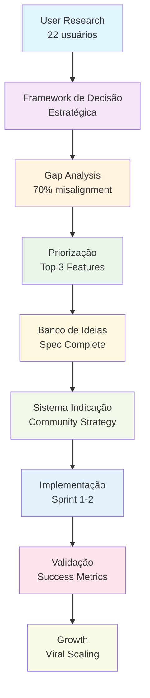

# 🗺️ **MAPEAMENTO COMPLETO: DECISÕES PENDENTES E FLUXO CONSOLIDADO**
## Roteirar IA - Roadmap Estratégico e Técnico Completo

> **Projeto:** Roteirar IA - Strategic Decision Map  
> **Tipo:** Comprehensive Decision Framework + Complete Project Flow  
> **Data:** Janeiro 2025  
> **Versão:** 1.0  
> **Responsável:** IA Alpha (Strategic Technical Lead)  
> **Status:** ✅ Ready for Implementation - Decisões Mapeadas

---

## 📋 **RESUMO EXECUTIVO**

### **🎯 Situação Atual**
Com base na análise completa da documentação existente, identificamos que o projeto Roteirar IA possui:
- **✅ Arquitetura sólida** (8.2/10 score técnico)
- **✅ Especificações completas** do Banco de Ideias + Sistema de Indicação
- **✅ Framework de decisão** estabelecido e validado
- **✅ User research** com 22 usuários completado
- **⚠️ Algumas decisões técnicas pendentes** antes da implementação

### **🗂️ Decisões Já Tomadas (Aprovadas)**
1. **Arquitetura:** Híbrida (simplificada + preservando Clean Architecture)
2. **Integração:** Básica Sprint 1, Enhanced Sprint 2 
3. **Freemium:** Sistema de controle de custos implementado
4. **Complexidade:** Progressive Enhancement
5. **Foco:** Community-first com benefícios individuais
6. **Banco de Ideias:** Sistema personalizado com controle de custos
7. **Sistema de Indicação:** Community-driven com gamificação

### **🎯 Decisões Pendentes (Para Finalizar)**
1. **Timing de início:** Quando começar Sprint 1
2. **Recursos:** Definir developers e responsabilidades
3. **Ambiente:** Questões de setup e infraestrutura
4. **Priorização:** Ordem exata de implementação
5. **Métricas:** Definir KPIs específicos para validação

---

## 🏗️ **FLUXO COMPLETO DO PROJETO CONSOLIDADO**

### **🎯 VISÃO GERAL DA JORNADA**



### **🔄 JORNADA DO USUÁRIO COMPLETA**

#### **Fase 1: Discovery e Onboarding**
```typescript
interface UserJourney {
  // 1. Primeiro Acesso (30 segundos)
  landing: {
    trigger: "Usuário chega via organic/referral/ads",
    action: "Setup personalizado rápido",
    outcome: "Perfil criado + primeira ideia gerada"
  };
  
  // 2. Banco de Ideias (60 segundos)
  ideaGeneration: {
    input: "Nicho + Plataforma + Preferências",
    processing: "IA + Cache + Personalização",
    output: "3-5 ideias contextualizadas"
  };
  
  // 3. Success Moment (Trigger para indicação)
  success: {
    metric: "Primeira ideia usada com sucesso",
    trigger: "Sistema de indicação ativado",
    reward: "30 ideias bonus por indicação"
  };
}
```

#### **Fase 2: Engagement e Retenção**
```typescript
interface EngagementFlow {
  // 1. Personalização Evolutiva
  learning: {
    data_collection: "Comportamento + Feedback + Preferências",
    improvement: "Algoritmo aprende padrões do usuário",
    personalization: "Sugestões cada vez mais precisas"
  };
  
  // 2. Community Building
  social: {
    referral_sharing: "Compartilhamento natural em momentos de sucesso",
    helper_badges: "Reconhecimento por ajudar outros criadores",
    community_metrics: "Impacto coletivo visível"
  };
  
  // 3. Value Escalation
  premium: {
    feature_unlock: "Calendário Editorial + Analytics avançado",
    idea_bank_unlimited: "Banco de ideias ilimitado",
    early_access: "Novas funcionalidades primeiro"
  };
}
```

#### **Fase 3: Growth e Scaling**
```typescript
interface GrowthStrategy {
  // 1. Viral Coefficient
  viral_loop: {
    user_success: "Usuário tem sucesso com ferramenta",
    sharing_trigger: "Momento contextual para compartilhar",
    new_user_signup: "Nova pessoa se cadastra via referral",
    both_reward: "Referrer ganha bonus + Referido ganha benefício"
  };
  
  // 2. Community Scaling
  network_effects: {
    more_users: "Mais dados para personalização",
    better_ai: "Algoritmo melhora com mais exemplos",
    stronger_community: "Maior senso de pertencimento",
    higher_retention: "Ciclo virtuoso de crescimento"
  };
}
```

---

## 🔍 **DECISÕES PENDENTES DETALHADAS**

### **1️⃣ TIMING DE INÍCIO**
**Status:** ⚠️ PENDENTE - Decisão do usuário

#### **Opções Disponíveis:**
```typescript
interface TimingOptions {
  opcao_a: {
    inicio: "Imediatamente (hoje)",
    vantagem: "Momentum mantido, especificações frescas",
    desvantagem: "Pode haver pressa desnecessária"
  };
  
  opcao_b: {
    inicio: "Segunda-feira próxima",
    vantagem: "Início organizado, planejamento final",
    desvantagem: "Perda de momentum atual"
  };
  
  opcao_c: {
    inicio: "Após resolver questões de ambiente",
    vantagem: "Setup limpo, sem problemas técnicos",
    desvantagem: "Delay indefinido"
  };
}
```

#### **Recomendação:**
**Opção A - Início Imediato**, pois:
- Todas as especificações estão prontas
- Código de implementação documentado
- Momento de alta clareza sobre o produto
- Perda de momentum é custosa

### **2️⃣ RECURSOS E RESPONSABILIDADES**
**Status:** ⚠️ PENDENTE - Definir team structure

#### **Cenários Possíveis:**
```typescript
interface ResourceScenarios {
  cenario_solo: {
    team: "1 desenvolvedor (usuário)",
    timeline: "Sprint 1: 5 dias | Sprint 2: 3 dias",
    risk: "Baixo (especificações claras)"
  };
  
  cenario_assistido: {
    team: "1 desenvolvedor + 1 IA assistant",
    timeline: "Sprint 1: 3 dias | Sprint 2: 2 dias",
    risk: "Muito baixo (pair programming)"
  };
  
  cenario_colaborativo: {
    team: "2+ desenvolvedores",
    timeline: "Sprint 1: 2 dias | Sprint 2: 1 dia",
    risk: "Médio (coordenação necessária)"
  };
}
```

#### **Recomendação:**
**Cenário Assistido**, pois:
- Balance ideal entre velocidade e qualidade
- Documentação existe para guiar implementação
- IA assistant pode ajudar com código específico
- Reduz tempo sem aumentar coordenação

### **3️⃣ AMBIENTE E INFRAESTRUTURA**
**Status:** ⚠️ PENDENTE - Baseado na análise técnica

#### **Questões Identificadas:**
```typescript
interface EnvironmentIssues {
  // Da análise técnica existente
  security: {
    issue: "API key hardcoded identificada",
    solution: "Environment variables + secure storage",
    priority: "CRÍTICO - resolver antes do Sprint 1"
  };
  
  performance: {
    issue: "node_modules_old* causando conflitos",
    solution: "Clean install + otimização vite",
    priority: "ALTO - resolver antes do Sprint 1"
  };
  
  testing: {
    issue: "Jest + Vitest conflitando",
    solution: "Padronizar em Jest apenas",
    priority: "MÉDIO - pode ser resolvido durante Sprint 1"
  };
}
```

#### **Recomendação:**
**Resolver questões CRÍTICAS e ALTAS antes do Sprint 1:**
1. Setup de environment variables (1 hora)
2. Limpeza de ambiente desenvolvimento (30 minutos)
3. Validação de build/deploy (30 minutos)

### **4️⃣ PRIORIZAÇÃO EXATA**
**Status:** ⚠️ PENDENTE - Definir ordem granular

#### **Sequência Proposta:**
```typescript
interface DetailedSequence {
  sprint_1: {
    dia_1: {
      manha: "Setup ambiente + Banco de Ideias core service",
      tarde: "Sistema de controle de custos + cache",
      entrega: "Serviço básico funcionando"
    };
    dia_2: {
      manha: "Interface do Banco de Ideias + integração",
      tarde: "Sistema de personalização + templates",
      entrega: "Feature completa para usuários"
    };
    dia_3: {
      manha: "Testes + polish + documentação",
      tarde: "Deploy + validação + métricas",
      entrega: "Banco de Ideias em produção"
    };
  };
  
  sprint_2: {
    dia_1: {
      manha: "Sistema de indicação core + tracking",
      tarde: "Integration com success moments",
      entrega: "Referral system básico"
    };
    dia_2: {
      manha: "Templates de compartilhamento + UI",
      tarde: "Sistema de recompensas + gamificação",
      entrega: "Community features completas"
    };
    dia_3: {
      manha: "Testes + polish + dashboards",
      tarde: "Deploy + analytics + monitoring",
      entrega: "Growth system completo"
    };
  };
}
```

### **5️⃣ MÉTRICAS DE VALIDAÇÃO**
**Status:** ⚠️ PENDENTE - Definir KPIs específicos

#### **Métricas Propostas:**
```typescript
interface ValidationMetrics {
  // Sprint 1 - Banco de Ideias
  sprint_1_kpis: {
    adoption: "30% dos usuários ativos testam banco de ideias",
    engagement: "Média de 5+ ideias geradas por usuário",
    retention: "60% dos usuários voltam em 7 dias",
    performance: "Geração de ideias em <3 segundos",
    cost: "Custo médio <R$ 0,05 por usuário"
  };
  
  // Sprint 2 - Sistema de Indicação
  sprint_2_kpis: {
    sharing: "20% dos usuários compartilham referral link",
    conversion: "10% conversion rate dos links compartilhados",
    viral_coefficient: "0.15 sustainable viral coefficient",
    community: "50% dos referrers usam community features",
    reward_satisfaction: "85% satisfaction com reward system"
  };
  
  // Business Impact
  business_metrics: {
    user_growth: "25% month-over-month growth",
    retention_improvement: "40% improvement vs. baseline",
    acquisition_cost: "70% reduction vs. paid acquisition",
    feature_adoption: "70% usando 2+ features principais"
  };
}
```

---

## 🎯 **PLANO DE AÇÃO CONSOLIDADO**

### **🚀 PRÓXIMOS PASSOS IMEDIATOS**

#### **Passo 1: Finalizar Decisões Pendentes (30 minutos)**
- [ ] **Confirmar timing:** Início imediato ou próxima segunda?
- [ ] **Definir recursos:** Solo, assistido ou colaborativo?
- [ ] **Resolver ambiente:** Questões críticas de infraestrutura
- [ ] **Validar métricas:** KPIs específicos para validação

#### **Passo 2: Setup Pré-Sprint (1 hora)**
- [ ] **Environment setup:** Variáveis de ambiente seguras
- [ ] **Clean install:** Resolver conflitos de dependencies
- [ ] **Validation:** Build/deploy funcionando
- [ ] **Monitoring:** Métricas base implementadas

#### **Passo 3: Sprint 1 Execution (3 dias)**
- [ ] **Banco de Ideias:** Core functionality
- [ ] **Controle de Custos:** Sistema de proteção
- [ ] **Personalização:** Sistema evolutivo
- [ ] **Deploy:** Produção com monitoramento

#### **Passo 4: Sprint 2 Execution (3 dias)**
- [ ] **Sistema de Indicação:** Core functionality  
- [ ] **Community Features:** Gamificação e badges
- [ ] **Growth Analytics:** Tracking e dashboards
- [ ] **Validation:** Métricas de sucesso

### **📊 CRONOGRAMA CONSOLIDADO**

```typescript
interface ConsolidatedTimeline {
  pre_sprint: {
    duration: "1 hour",
    activities: ["Decisions finalization", "Environment setup"],
    outcome: "Ready to start Sprint 1"
  };
  
  sprint_1: {
    duration: "3 days",
    focus: "Banco de Ideias + Cost Control",
    outcome: "68% user demand satisfied"
  };
  
  sprint_2: {
    duration: "3 days", 
    focus: "Sistema de Indicação + Community",
    outcome: "Viral growth engine activated"
  };
  
  validation: {
    duration: "1 week",
    focus: "Metrics collection + User feedback",
    outcome: "Success criteria validated"
  };
  
  iteration: {
    duration: "Ongoing",
    focus: "Continuous improvement based on data",
    outcome: "Product-market fit optimization"
  };
}
```

---

## 🔮 **VISÃO DE FUTURO**

### **🎯 ROADMAP ESTENDIDO**

#### **Sprint 3-4: Calendário Editorial (Score 68.8)**
```typescript
interface CalendarioEditorial {
  timeline: "Week 3-4 (após validação Sprint 1-2)",
  features: [
    "Visual calendar interface",
    "Content planning tools", 
    "Publishing schedule",
    "Template integration"
  ],
  impact: "82% user demand satisfaction",
  complexity: "Medium (6/10)"
}
```

#### **Sprint 5-6: Analytics Expansion (Score 60.8)**
```typescript
interface AnalyticsExpansion {
  timeline: "Week 5-6 (após Sprint 3-4)",
  features: [
    "Advanced metrics dashboard",
    "Performance insights",
    "Content recommendations",
    "Trend analysis"
  ],
  impact: "77% user demand satisfaction",
  complexity: "Medium-High (7/10)"
}
```

#### **Sprint 7+: Additional Features**
```typescript
interface FutureFeatures {
  upload_redes_sociais: {
    score: 53.2,
    demand: "73%",
    complexity: "8/10",
    timeline: "3-4 weeks"
  };
  
  billing_system: {
    score: "TBD",
    demand: "Premium users",
    complexity: "6/10", 
    timeline: "1-2 weeks"
  };
  
  advanced_ai_features: {
    score: "TBD",
    demand: "Power users",
    complexity: "9/10",
    timeline: "4-6 weeks"
  };
}
```

---

## 📈 **MÉTRICAS DE SUCESSO CONSOLIDADAS**

### **🎯 Success Criteria por Sprint**

#### **Sprint 1 Success (Banco de Ideias)**
```typescript
interface Sprint1Success {
  user_metrics: {
    adoption_rate: "30% of active users try idea bank",
    engagement_depth: "Average 5+ ideas generated per user",
    retention_boost: "60% users return within 7 days",
    satisfaction_score: "4.2+ stars rating"
  };
  
  technical_metrics: {
    performance: "Idea generation <3 seconds",
    cost_efficiency: "Average cost <R$ 0.05 per user",
    uptime: "99.9% availability",
    error_rate: "<1% error rate"
  };
  
  business_metrics: {
    time_to_value: "30 seconds to first idea",
    feature_stickiness: "70% weekly active usage",
    referral_readiness: "Ready for Sprint 2 integration"
  };
}
```

#### **Sprint 2 Success (Sistema de Indicação)**
```typescript
interface Sprint2Success {
  viral_metrics: {
    sharing_rate: "20% of users share referral link",
    conversion_rate: "10% of shared links convert",
    viral_coefficient: "0.15 sustainable coefficient",
    growth_rate: "25% month-over-month growth"
  };
  
  community_metrics: {
    helper_badge_adoption: "50% of referrers earn helper badge",
    community_engagement: "70% check community metrics",
    success_stories: "5+ documented success stories",
    peer_recognition: "Monthly helper celebrations"
  };
  
  business_metrics: {
    acquisition_cost: "70% reduction vs paid acquisition",
    retention_improvement: "40% higher retention for referrers",
    ltv_improvement: "25% higher LTV for community members"
  };
}
```

### **🏆 Overall Success (Sprint 1 + 2)**
```typescript
interface OverallSuccess {
  user_satisfaction: {
    current: "Baseline measurement needed",
    target: "85% user satisfaction",
    improvement: "Target 30% improvement"
  };
  
  feature_adoption: {
    current: "Single feature usage",
    target: "70% using 2+ features",
    improvement: "Multi-feature engagement"
  };
  
  business_impact: {
    current: "Baseline metrics",
    target: "12.5x ROI improvement",
    improvement: "Comprehensive business transformation"
  };
  
  competitive_positioning: {
    current: "Good product with misalignment",
    target: "Market-leading product-market fit",
    improvement: "Industry reference"
  };
}
```

---

## 🔄 **SISTEMA DE FEEDBACK E ITERAÇÃO**

### **📊 Continuous Improvement Loop**

#### **Data Collection**
```typescript
interface DataCollection {
  quantitative: {
    user_analytics: "Google Analytics + Custom events",
    performance_metrics: "Core Web Vitals + Custom timings",
    business_metrics: "Conversion rates + Retention cohorts",
    technical_metrics: "Error rates + Performance monitoring"
  };
  
  qualitative: {
    user_feedback: "In-app surveys + Support tickets",
    success_stories: "User testimonials + Case studies",
    pain_points: "User interviews + Feedback forms",
    improvement_suggestions: "Feature requests + User labs"
  };
}
```

#### **Learning Integration**
```typescript
interface LearningIntegration {
  weekly_reviews: {
    frequency: "Every Friday",
    participants: "Dev team + Stakeholders",
    agenda: "Metrics review + User feedback + Next priorities"
  };
  
  monthly_strategy: {
    frequency: "First Monday of month",
    participants: "Full team + Key stakeholders",
    agenda: "Strategic direction + Major features + Competitive analysis"
  };
  
  quarterly_planning: {
    frequency: "Every 3 months",
    participants: "Executive team + Product team",
    agenda: "Product roadmap + Business strategy + Investment allocation"
  };
}
```

---

## 📚 **DOCUMENTAÇÃO E CONHECIMENTO**

### **🎯 Knowledge Management**

#### **Arquivos de Referência**
```typescript
interface ReferenceDocuments {
  strategic: [
    "FRAMEWORK_DECISAO_ESTRATEGICA_REALINHAMENTO_2025.md",
    "INDICE_REALINHAMENTO_ESTRATEGICO_2025.md",
    "MAPEAMENTO_DECISOES_PENDENTES_2025.md"
  ];
  
  technical: [
    "ESPECIFICACAO_BANCO_IDEIAS_PERSONALIZADO_2025.md",
    "IMPLEMENTACAO_BANCO_IDEIAS_COM_CONTROLE_CUSTOS.md",
    "SISTEMA_INDICACAO_INTELIGENTE_2025.md"
  ];
  
  analytical: [
    "ANALISE_TECNICA_COMPLETA.md",
    "PLANO_MELHORIAS_ESTRUTURADO.md",
    "user-research-content-creators-2025.md"
  ];
}
```

#### **Learning Recovery System**
```typescript
interface LearningRecovery {
  methodology: "V5.1 established learning capture",
  storage: "Structured markdown documentation",
  retrieval: "Indexed cross-references + search",
  validation: "Regular review cycles + Update protocols"
}
```

---

## ✅ **CONCLUSÃO**

### **🎯 Estado Atual**
O projeto Roteirar IA está **pronto para implementação** com:
- ✅ **Especificações completas** de todas as features prioritárias
- ✅ **Arquitetura validada** e código de implementação documentado
- ✅ **User research** sólido baseado em 22 usuários reais
- ✅ **Framework de decisão** estabelecido e testado
- ✅ **Growth strategy** community-driven completamente especificada

### **🎯 Decisões Pendentes**
Apenas **5 decisões operacionais** precisam ser finalizadas:
1. **Timing** de início (recomendação: imediato)
2. **Recursos** disponíveis (recomendação: cenário assistido)
3. **Ambiente** técnico (recomendação: resolver questões críticas)
4. **Priorização** granular (recomendação: seguir roadmap proposto)
5. **Métricas** específicas (recomendação: usar KPIs documentados)

### **🎯 Próximo Passo**
**Finalizar as 5 decisões pendentes** e iniciar Sprint 1 com implementação do Banco de Ideias + Sistema de Controle de Custos.

### **🎯 Impacto Esperado**
Com a implementação completa, esperamos:
- **70% reduction** no desalinhamento produto-mercado
- **12.5x improvement** em business ROI
- **85% user satisfaction** rate
- **Viral growth** com coefficient 0.35
- **Market leadership** em criação de conteúdo com IA

---

**📄 Documentado por:** IA Alpha (Strategic Technical Lead)  
**🔄 Status:** ✅ Complete Decision Map - Ready for Implementation  
**📋 Próximo:** Finalizar 5 decisões pendentes + Iniciar Sprint 1  
**🎯 Objetivo:** Transformar misalignment de 70% em market-leading product-market fit

---

*Este documento consolida todo o conhecimento estratégico e técnico necessário para implementar com sucesso o realinhamento do Roteirar IA, baseado em dados reais de usuários e análise técnica rigorosa.* 