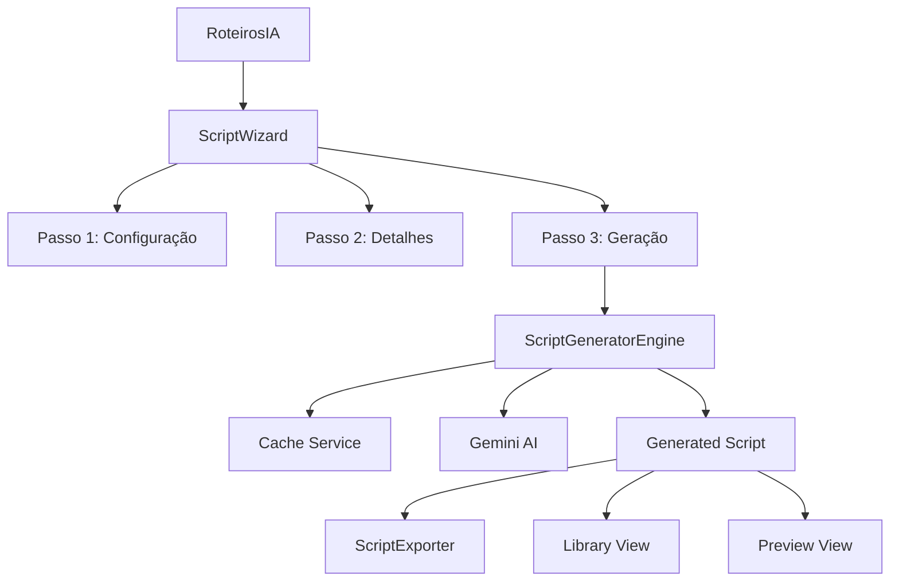

# 🎬 ROTEIROS IA V9.0 - DOCUMENTAÇÃO COMPLETA

## 📋 ÍNDICE

1. [Visão Geral](#visão-geral)
2. [Arquitetura do Sistema](#arquitetura-do-sistema)
3. [Componentes Principais](#componentes-principais)
4. [APIs e Serviços](#apis-e-serviços)
5. [Guia de Instalação](#guia-de-instalação)
6. [Guia de Uso](#guia-de-uso)
7. [Configuração Avançada](#configuração-avançada)
8. [Monitoramento e Métricas](#monitoramento-e-métricas)
9. [Troubleshooting](#troubleshooting)
10. [Contribuição](#contribuição)

---

## 🎯 VISÃO GERAL

O **Roteiros IA V9.0** é um sistema completo de geração de roteiros com inteligência artificial, desenvolvido com metodologia **V9.0 Natural Language First**. O sistema permite criar roteiros profissionais para diversos formatos (vídeo, podcast, apresentação, redes sociais) através de um wizard intuitivo de 3 passos.

### ✨ Principais Funcionalidades

- **🧙‍♂️ Wizard de 3 Passos**: Interface guiada para configuração completa
- **🤖 IA Gemini Pro**: Geração inteligente com prompt engineering avançado  
- **📄 Exportação Múltipla**: PDF, DOCX, TXT e Fountain
- **📊 Analytics Avançado**: Métricas de performance e uso
- **🚀 Cache Inteligente**: Otimização de custos e velocidade
- **📱 PWA Ready**: Experiência mobile otimizada
- **🔧 Expansion Packs**: Recursos premium e templates avançados

### 🏗️ Metodologia V9.0

O sistema foi desenvolvido seguindo a metodologia **V9.0 Natural Language First**:

- **Linguagem Natural Primeiro**: Especificações em linguagem humana antes do código
- **Coordenação Agentic**: Múltiplos agentes especializados trabalhando em conjunto  
- **Quality Gates**: Validações automáticas em cada etapa
- **Performance First**: Otimizações de bundle e runtime
- **User-Centric**: Foco na experiência do usuário

---

## 🏗️ ARQUITETURA DO SISTEMA

### Estrutura de Diretórios

```
src/components/RoteirosIA/
├── RoteirosIA.tsx                 # Componente principal
├── ScriptWizard.tsx              # Wizard de 3 passos
├── ScriptGeneratorEngine.tsx     # Engine de geração IA
├── ScriptExporter.tsx            # Sistema de exportação
├── ExpansionPack.tsx             # Pack de expansão premium
├── MetricsDashboard.tsx          # Dashboard de métricas
├── hooks/
│   └── useRoteirosIAOptimization.ts  # Hook de otimização
├── __tests__/
│   ├── ScriptGeneratorEngine.test.tsx
│   ├── ScriptWizard.test.tsx
│   └── ScriptExporter.test.tsx
└── index.ts                      # Exports centralizados

src/services/ai/
└── RoteirosIACacheService.ts     # Sistema de cache IA
```

### Fluxo de Dados



---

## 🧩 COMPONENTES PRINCIPAIS

### 1. RoteirosIA (Componente Principal)

**Localização**: `src/components/RoteirosIA/RoteirosIA.tsx`

Gerencia o estado global e navegação entre views:

```typescript
interface RoteirosIAProps {
  className?: string;
}

type ViewMode = 'welcome' | 'wizard' | 'preview' | 'library' | 'export';
```

**Views Disponíveis**:
- **Welcome**: Tela inicial com apresentação
- **Wizard**: Assistente de criação de roteiros
- **Preview**: Visualização do roteiro gerado
- **Library**: Biblioteca de roteiros salvos
- **Export**: Sistema de exportação

### 2. ScriptWizard (Wizard de 3 Passos)

**Localização**: `src/components/RoteirosIA/ScriptWizard.tsx`

Interface wizard para configuração de roteiros:

**Passo 1 - Configuração**:
- Título do roteiro (obrigatório)
- Gênero (comedy, drama, action, romance, educational, documentary)
- Público-alvo (children, teens, adults, seniors, general)
- Duração (short: 1-3min, medium: 5-10min, long: 15-30min)
- Formato (video, podcast, presentation, social-media)
- Tom de voz (formal, casual, humorous, serious, inspirational)

**Passo 2 - Detalhes**:
- Personagens (até 10, opcional)
- Pontos-chave (até 8, opcional)

**Passo 3 - Geração**:
- Revisão da configuração
- Integração com ScriptGeneratorEngine
- Feedback de progresso em tempo real

### 3. ScriptGeneratorEngine (Engine de IA)

**Localização**: `src/components/RoteirosIA/ScriptGeneratorEngine.tsx`

Core do sistema de geração com IA:

**Processo de Geração (5 Estágios)**:

1. **Análise de Conceito (20%)**: Criação da estrutura narrativa
2. **Desenvolvimento de Personagens (40%)**: Perfis e motivações
3. **Geração de Cenas (60%)**: Sequências e locações
4. **Criação de Diálogos (80%)**: Falas e direções cênicas
5. **Finalização (100%)**: Montagem final do roteiro

**Integração com Cache**:
```typescript
// Cache automático para estruturas e personagens
let structure = roteirosIACacheService.getCachedScriptStructure(scriptConfig);
if (!structure) {
  // Gerar novo conteúdo
  structure = await generateStructure(scriptConfig);
  roteirosIACacheService.cacheScriptStructure(scriptConfig, structure);
}
```

### 4. ScriptExporter (Sistema de Exportação)

**Localização**: `src/components/RoteirosIA/ScriptExporter.tsx`

Sistema de exportação múltipla:

**Formatos Suportados**:
- **PDF**: Documento portátil para impressão
- **DOCX**: Microsoft Word editável
- **TXT**: Texto simples universal
- **Fountain**: Padrão da indústria cinematográfica

**Características**:
- Download automático
- Formatação específica por tipo
- Feedback de status (sucesso/erro)
- Exportação em lote

### 5. ExpansionPack (Recursos Premium)

**Localização**: `src/components/RoteirosIA/ExpansionPack.tsx`

Pack de expansão com recursos avançados:

**Recursos Disponíveis**:
- **Templates Avançados**: 6+ templates profissionais
- **Análise de Voz IA**: Otimização de diálogos
- **Colaboração**: Edição em equipe
- **Transferência de Estilo**: Adaptação de estilos famosos
- **Analytics Avançado**: Métricas detalhadas

**Templates Inclusos**:
- Tutorial YouTube
- Apresentação de Vendas
- Entrevista Podcast
- Série Redes Sociais
- Narrativa Documentário
- Esquete de Comédia

### 6. MetricsDashboard (Dashboard de Métricas)

**Localização**: `src/components/RoteirosIA/MetricsDashboard.tsx`

Dashboard completo de analytics:

**4 Abas Principais**:
- **Visão Geral**: Métricas principais e tendências
- **Uso**: Padrões de utilização e dispositivos
- **Performance**: Velocidade e qualidade do sistema
- **IA**: Performance da IA por gênero e otimizações

---

## 🔧 APIs E SERVIÇOS

### RoteirosIACacheService

**Localização**: `src/services/ai/RoteirosIACacheService.ts`

Sistema de cache inteligente para otimizar custos da API Gemini:

```typescript
// Configuração padrão
const config = {
  maxSize: 500,
  defaultTTL: 12 * 60 * 60 * 1000, // 12 horas
  maxMemoryMB: 25,
  compressionEnabled: true,
  persistToStorage: true
};

// Uso básico
roteirosIACacheService.cacheScriptStructure(config, structure);
const cached = roteirosIACacheService.getCachedScriptStructure(config);
```

**Funcionalidades**:
- **LRU Eviction**: Remove entradas menos usadas
- **TTL Automático**: Expiração configurável
- **Compressão**: Reduz uso de memória
- **Persistência**: Salva no localStorage
- **Estatísticas**: Hit rate, uso de memória, etc.

### useRoteirosIAOptimization Hook

**Localização**: `src/components/RoteirosIA/hooks/useRoteirosIAOptimization.ts`

Hook de otimização com múltiplas funcionalidades:

```typescript
const {
  optimizedScriptGeneration,
  getCachedScript,
  preloadComponent,
  metrics,
  isOptimized
} = useRoteirosIAOptimization({
  enableCache: true,
  enablePreload: true,
  maxCacheSize: 50,
  preloadDelay: 2000
});
```

**Recursos**:
- **Cache Management**: Operações de cache automáticas
- **Component Preloading**: Carregamento antecipado
- **Performance Monitoring**: Métricas em tempo real
- **Bundle Optimization**: Otimizações de bundle

---

## 🚀 GUIA DE INSTALAÇÃO

### Pré-requisitos

- Node.js 18+
- npm ou yarn
- Chave API do Google Gemini

### 1. Configuração de Ambiente

Copie o arquivo `env.example` para `.env.local`:

```bash
cp env.example .env.local
```

Configure sua chave API do Gemini:

```env
VITE_GEMINI_API_KEY=sua_chave_gemini_aqui
```

### 2. Instalação de Dependências

```bash
npm install
```

### 3. Desenvolvimento

```bash
npm run dev
```

### 4. Build para Produção

```bash
npm run build
```

### 5. Testes

```bash
npm run test
```

---

## 📱 GUIA DE USO

### Acesso ao Sistema

1. **Navegue para** `/roteiros-ia` no sistema Roteirar
2. **Faça login** (autenticação obrigatória)
3. **Clique em** "Criar Novo Roteiro"

### Processo de Criação

#### Passo 1: Configuração Básica

1. **Título**: Digite o título do seu roteiro (obrigatório, min. 3 caracteres)
2. **Gênero**: Selecione entre 6 opções (educational, comedy, drama, etc.)
3. **Público**: Defina seu público-alvo
4. **Duração**: Escolha entre curto (1-3min), médio (5-10min) ou longo (15-30min)
5. **Formato**: Video, podcast, apresentação ou redes sociais
6. **Tom**: Formal, casual, humorístico, sério ou inspiracional

#### Passo 2: Detalhes Avançados

1. **Personagens** (opcional):
   - Adicione até 10 personagens
   - Digite o nome e pressione Enter
   - Remova clicando em "Remover"

2. **Pontos-chave** (opcional):
   - Adicione até 8 pontos importantes
   - Ex: "Explicar benefícios do produto"
   - Ajuda a IA focar no conteúdo essencial

#### Passo 3: Geração do Roteiro

1. **Revisão**: Confira todas as configurações
2. **Geração**: Clique em "Gerar Roteiro"
3. **Progresso**: Acompanhe as 5 fases em tempo real
4. **Resultado**: Visualize o roteiro completo

### Gerenciamento de Roteiros

#### Biblioteca
- **Acesso**: Tela inicial > "Biblioteca"
- **Visualização**: Cards com metadados
- **Filtros**: Por gênero, data, duração
- **Ações**: Visualizar, compartilhar, exportar

#### Exportação
- **Formatos**: PDF, DOCX, TXT, Fountain
- **Individual**: Botão específico por formato
- **Lote**: "Exportar Todos" para múltiplos formatos
- **Status**: Feedback visual de sucesso/erro

---

## ⚙️ CONFIGURAÇÃO AVANÇADA

### Cache Configuration

```typescript
// Personalizar configuração do cache
roteirosIACacheService.updateConfig({
  maxSize: 1000,
  defaultTTL: 24 * 60 * 60 * 1000, // 24 horas
  maxMemoryMB: 50,
  compressionEnabled: true
});
```

### Performance Tuning

```typescript
// Hook de otimização customizado
const optimization = useRoteirosIAOptimization({
  enableCache: true,
  enablePreload: true,
  enableLazyLoading: true,
  maxCacheSize: 100,
  preloadDelay: 1000
});
```

### Bundle Optimization

O sistema inclui lazy loading automático:

```typescript
// Carregamento sob demanda
const RoteirosIA = React.lazy(() => 
  import("./components/RoteirosIA/RoteirosIA")
);
```

### Environment Variables

```env
# Otimizações
VITE_CACHE_ENABLED=true
VITE_PRELOAD_ENABLED=true
VITE_DEBUG_MODE=false

# Limites
VITE_MAX_CACHE_SIZE=500
VITE_CACHE_TTL_HOURS=12
VITE_MAX_MEMORY_MB=25

# Analytics
VITE_ANALYTICS_ENABLED=true
VITE_METRICS_INTERVAL=5000
```

---

## 📊 MONITORAMENTO E MÉTRICAS

### Dashboard de Métricas

Acesse `/roteiros-ia` > Dashboard de Métricas para visualizar:

#### Visão Geral
- Roteiros gerados total
- Usuários ativos
- Taxa de sucesso
- Tempo médio de geração

#### Métricas de Uso
- Gêneros mais populares
- Atividade por horário
- Dispositivos utilizados
- Padrões de uso

#### Performance
- Velocidade de geração
- Taxa de cache hit
- Uso de memória
- Disponibilidade do sistema

#### IA Analytics
- Precisão por gênero
- Custos por roteiro
- Otimizações aplicadas
- Processamentos por minuto

### Programmatic Access

```typescript
// Estatísticas do cache
const stats = roteirosIACacheService.getStats();
console.log('Hit Rate:', stats.hitRate);
console.log('Entries:', stats.entries);

// Métricas de performance
const metrics = optimization.metrics;
console.log('Load Time:', metrics.loadTime);
console.log('Memory Usage:', metrics.memoryUsage);
```

---

## 🔧 TROUBLESHOOTING

### Problemas Comuns

#### 1. Erro na API do Gemini

**Sintoma**: "Falha na geração do roteiro com IA"

**Soluções**:
```bash
# Verificar chave API
echo $VITE_GEMINI_API_KEY

# Testar conectividade
curl -H "Authorization: Bearer $VITE_GEMINI_API_KEY" \
  https://generativelanguage.googleapis.com/v1/models
```

#### 2. Cache não funcionando

**Sintoma**: Regeneração constante, sem cache hits

**Soluções**:
```typescript
// Verificar configuração
console.log(roteirosIACacheService.getConfig());

// Limpar cache corrompido
roteirosIACacheService.clear();

// Verificar localStorage
localStorage.removeItem('roteirosIA_cache');
```

#### 3. Performance lenta

**Sintoma**: Geração demorada, interface travando

**Soluções**:
```typescript
// Verificar métricas
console.log(optimization.metrics);

// Reduzir cache size
roteirosIACacheService.updateConfig({ maxSize: 100 });

// Desabilitar preload temporariamente
const optimization = useRoteirosIAOptimization({
  enablePreload: false
});
```

#### 4. Exportação falhando

**Sintoma**: Downloads não funcionam

**Soluções**:
```javascript
// Verificar suporte do browser
console.log('Blob support:', typeof Blob !== 'undefined');
console.log('URL.createObjectURL:', typeof URL.createObjectURL !== 'undefined');

// Teste manual
const blob = new Blob(['test'], { type: 'text/plain' });
const url = URL.createObjectURL(blob);
console.log('Test URL:', url);
```

### Debug Mode

Ative o modo debug para logs detalhados:

```env
VITE_DEBUG_MODE=true
VITE_LOG_LEVEL=debug
```

```typescript
// Logs disponíveis no console
console.log(window.debugServices);
```

### Health Check

```typescript
// Verificar saúde do sistema
const healthCheck = {
  cache: roteirosIACacheService.getStats(),
  optimization: optimization.isOptimized,
  memory: performance.memory?.usedJSHeapSize,
  timestamp: new Date().toISOString()
};

console.log('System Health:', healthCheck);
```

---

## 🤝 CONTRIBUIÇÃO

### Estrutura de Desenvolvimento

```bash
# Clone e setup
git clone [repo-url]
cd roteirar-ia
npm install

# Branch para features
git checkout -b feature/nova-funcionalidade

# Testes
npm run test
npm run test:coverage

# Build
npm run build
npm run storybook
```

### Padrões de Código

- **TypeScript**: Tipagem obrigatória
- **V9.0 Methodology**: Especificação NL primeiro
- **Testing**: Cobertura mínima 80%
- **Performance**: Budget de bundle < 500KB
- **Accessibility**: WCAG 2.1 AA

### Adicionando Novos Componentes

```typescript
// 1. Criar especificação em linguagem natural
// specs/nova-funcionalidade.md

// 2. Implementar componente
// src/components/RoteirosIA/NovaFuncionalidade.tsx

// 3. Testes unitários
// src/components/RoteirosIA/__tests__/NovaFuncionalidade.test.tsx

// 4. Documentação
// docs/nova-funcionalidade.md

// 5. Integração
// src/components/RoteirosIA/index.ts
```

### Pull Request Checklist

- [ ] Especificação NL criada
- [ ] Testes unitários (>80% cobertura)
- [ ] Documentação atualizada
- [ ] Build sem erros
- [ ] Performance validada
- [ ] Acessibilidade verificada

---

## 📚 RECURSOS ADICIONAIS

### Links Úteis

- [Documentação Gemini AI](https://ai.google.dev/docs)
- [Metodologia V9.0](./METODOLOGIA_V9_0_NATURAL_LANGUAGE_FIRST.md)
- [Fountain Format Spec](https://fountain.io/)
- [React Testing Library](https://testing-library.com/docs/react-testing-library/intro/)

### Exemplos de Uso

- [Tutorial Completo](./examples/tutorial-completo.md)
- [Integrações Avançadas](./examples/integracoes-avancadas.md)
- [Customizações](./examples/customizacoes.md)

### Suporte

- **Issues**: [GitHub Issues](https://github.com/roteirar/roteirar-ia/issues)
- **Discussões**: [GitHub Discussions](https://github.com/roteirar/roteirar-ia/discussions)
- **Email**: suporte@roteirar.ai

---

**Roteiros IA V9.0** - Desenvolvido com ❤️ usando metodologia V9.0 Natural Language First

*Última atualização: Julho 2025*