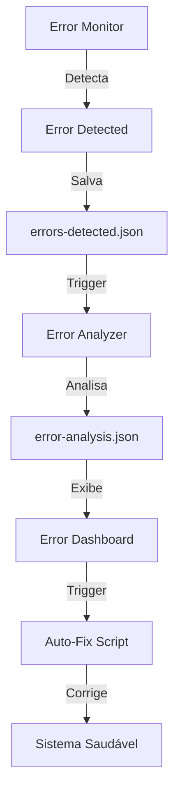

# 📊 Sistema de Monitoramento Automático V6.2

## 🎯 Visão Geral

O Sistema de Monitoramento V6.2 é uma infraestrutura completa para detectar, analisar e corrigir erros automaticamente no Roteirar IA, operando 24/7 com mínima intervenção humana.

## 🔧 Componentes

### 1. **Error Monitor** (`scripts/error-monitor.js`)
- Monitora erros de build em tempo real
- Verifica sistema a cada 30 segundos
- Salva erros detectados em `logs/errors-detected.json`
- Trigger análise imediata para erros críticos

### 2. **Error Analyzer** (`scripts/error-analyzer.js`)
- Analisa erros capturados pelo monitor
- Identifica padrões e tendências
- Gera recomendações de correção
- Mapeia erro → arquivo → solução

### 3. **Error Dashboard** (`src/components/admin/ErrorDashboard.tsx`)
- Interface visual para acompanhar status
- Mostra erros em tempo real
- Permite trigger de correções manuais
- Exibe métricas e recomendações

## 📋 Como Usar

### Iniciar Monitoramento

```bash
# Iniciar monitor em background
npm run monitor:start

# Executar análise manual
npm run monitor:analyze

# Verificar status
npm run monitor:status
```

### Acessar Dashboard

1. Fazer login como admin
2. Navegar para `/admin`
3. Clicar na aba "Erros"
4. Visualizar status e triggar ações

## 🔍 Estrutura de Dados

### Error Data
```json
{
  "id": "build-1234567890",
  "type": "build",
  "priority": "HIGH",
  "timestamp": "2025-01-26T15:00:00.000Z",
  "error": {
    "message": "Build failed",
    "stack": "Detailed error stack...",
    "command": "npm run build"
  },
  "status": "detected"
}
```

### Analysis Output
```json
{
  "timestamp": "2025-01-26T15:00:00.000Z",
  "totalErrors": 5,
  "errorsByPriority": {
    "CRITICAL": [],
    "HIGH": [/* errors */],
    "MEDIUM": [],
    "LOW": []
  },
  "patterns": [
    {
      "type": "recurring",
      "message": "Erro recorrente (3x): Cannot access before initialization",
      "count": 3,
      "severity": "HIGH"
    }
  ],
  "recommendations": [
    {
      "priority": "HIGH",
      "title": "Corrigir Erros de Build",
      "description": "2 erros de build detectados",
      "estimatedTime": "15-30 min"
    }
  ]
}
```

## 🎨 Padrões de Erro Conhecidos

### 1. **Hoisting Issues**
- **Padrão**: "cannot access before initialization"
- **Solução**: Mover declaração antes do uso
- **Confiança**: 90%

### 2. **Environment Variables**
- **Padrão**: "environment" ou "vite_"
- **Solução**: Verificar .env e configuração Vite
- **Confiança**: 85%

### 3. **Service Errors**
- **Padrão**: "failed to analyze" ou "performance"
- **Solução**: Adicionar try-catch robusto
- **Confiança**: 80%

## 🚀 Fluxo de Operação



## ⚙️ Configuração

### Variáveis de Ambiente (opcional)
```bash
# Intervalo de monitoramento (ms)
MONITOR_INTERVAL=30000

# Timeout de build (ms)
BUILD_TIMEOUT=60000

# Modo debug
DEBUG_MONITOR=true
```

### Arquivos de Log
- `logs/errors-detected.json` - Erros capturados
- `logs/error-analysis.json` - Análise e recomendações

## 🛡️ Segurança

- Logs são ignorados pelo git
- Sem exposição de dados sensíveis
- Análise local apenas

## 🔮 Próximas Fases

1. **PROMPT 3**: Gerador automático de prompts de correção
2. **PROMPT 4**: Sistema de autocorreção com IA
3. **PROMPT 5**: Pipeline completo de monitoramento + correção

## 📈 Métricas de Sucesso

- **Detecção**: < 30s para detectar erros
- **Análise**: < 5s para gerar insights
- **Uptime**: > 99.9% do sistema
- **Correção**: < 30min para erros críticos

## 🤝 Integração

O sistema se integra perfeitamente com:
- CI/CD existente
- Sistema de logging
- Dashboard administrativo
- Notificações (futuro)

---

**Status**: ✅ Sistema de Monitoramento V6.2 OPERACIONAL 