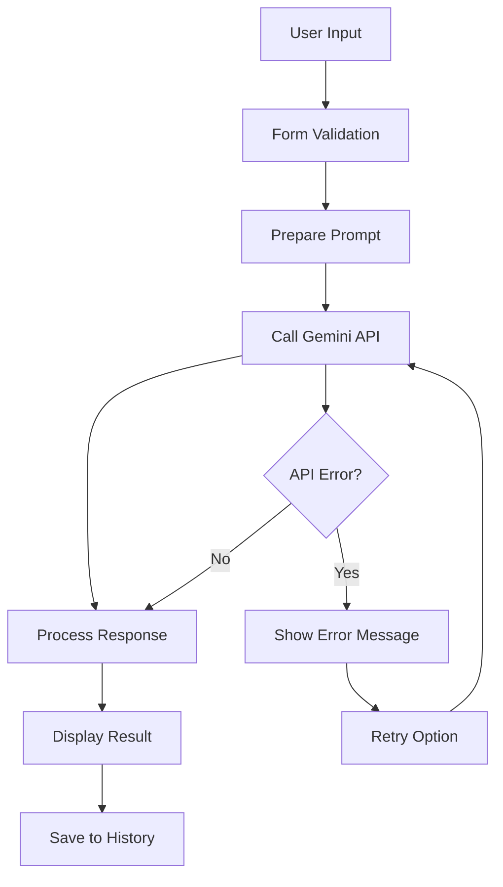
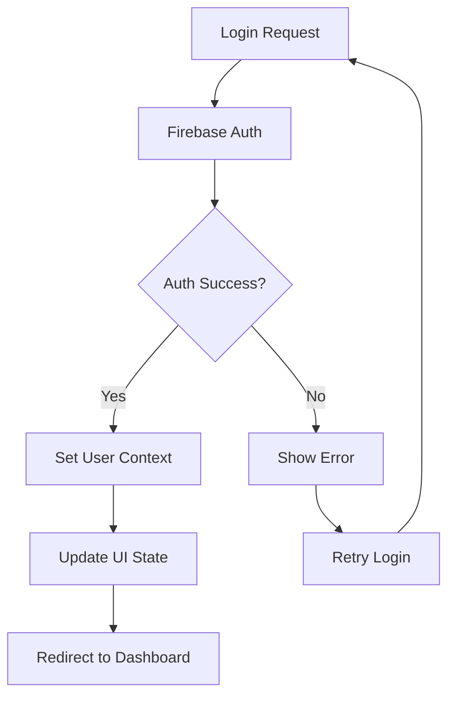
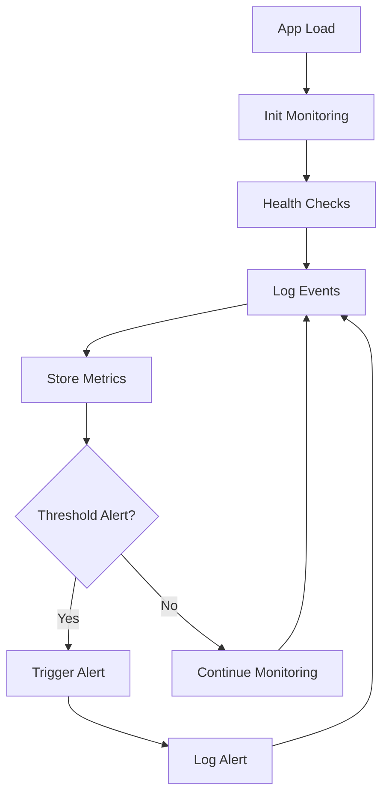
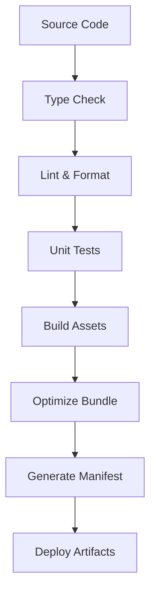

# 🏗️ Arquitetura do Sistema - Roteirizar IA

> Visão geral da arquitetura, componentes e fluxos de dados

## 📊 **Visão Geral da Arquitetura**

### **Diagrama de Alto Nível**
```
┌─────────────────┐    ┌─────────────────┐    ┌─────────────────┐
│   Frontend      │    │   Services      │    │   External APIs │
│   React App     │◄──►│   JavaScript    │◄──►│   Google Gemini │
│                 │    │   Firebase      │    │   Auth/Storage  │
└─────────────────┘    └─────────────────┘    └─────────────────┘
        │                       │                       │
        ▼                       ▼                       ▼
┌─────────────────┐    ┌─────────────────┐    ┌─────────────────┐
│   Browser       │    │   Local Storage │    │   Monitoring    │
│   DOM/Events    │    │   Session Data  │    │   Health Check  │
└─────────────────┘    └─────────────────┘    └─────────────────┘
```

### **Princípios Arquiteturais**
1. **Single Page Application (SPA)**: Navegação client-side
2. **Component-Based**: Reutilização e modularização
3. **Stateless**: Sem dependência de servidor de estado
4. **Progressive Enhancement**: Funciona offline limitadamente
5. **Mobile First**: Design responsivo nativo

---

## 🧩 **Componentes Principais**

### **Frontend Layer**
```typescript
interface FrontendArchitecture {
  ui: {
    framework: "React 19",
    styling: "Tailwind CSS",
    components: "shadcn/ui + custom",
    animations: "Framer Motion"
  },
  routing: {
    library: "React Router DOM",
    type: "Client-side routing",
    pages: ["Home", "Generator", "Auth", "Dashboard"]
  },
  state: {
    global: "React Context",
    local: "React useState/useReducer",
    persistence: "localStorage",
    forms: "React Hook Form"
  }
}
```

### **Service Layer**
```typescript
interface ServiceLayer {
  ai: {
    provider: "Google Gemini",
    models: ["gemini-1.5-flash", "gemini-pro"],
    features: ["text-generation", "content-optimization"]
  },
  auth: {
    provider: "Firebase Auth",
    methods: ["email/password", "google", "anonymous"],
    session: "JWT tokens"
  },
  storage: {
    user_data: "Firestore",
    app_data: "localStorage",
    files: "Browser downloads"
  }
}
```

### **External Integrations**
```typescript
interface ExternalAPIs {
  gemini: {
    endpoint: "https://generativelanguage.googleapis.com",
    authentication: "API Key",
    rate_limits: "60 requests/minute",
    fallback: "Error handling + retry"
  },
  firebase: {
    services: ["Auth", "Firestore", "Analytics"],
    region: "us-central1",
    security: "Rules-based"
  }
}
```

---

## 🔄 **Fluxos de Dados**

### **Fluxo de Geração de Roteiro**


### **Fluxo de Autenticação**


### **Fluxo de Monitoramento**


---

## 📁 **Estrutura de Componentes**

### **Hierarquia de Componentes**
```
App
├── Router
│   ├── HomePage
│   │   ├── HeroSection
│   │   ├── FeatureGrid
│   │   └── Footer
│   ├── GeneratorPage
│   │   ├── ScriptForm
│   │   │   ├── InputField
│   │   │   ├── PlatformSelector
│   │   │   ├── HybridSelectField
│   │   │   └── TextareaField
│   │   └── EditableScriptArea
│   └── DashboardPage (auth required)
│       ├── UserStats
│       ├── ScriptHistory
│       └── SettingsPanel
├── Navbar
├── ThemeToggle
└── GlobalProviders
    ├── AuthContext
    ├── ThemeContext
    └── MonitoringContext
```

### **Padrões de Componentes**

#### **Componente Base**
```typescript
interface ComponentPattern {
  props: {
    children?: ReactNode;
    className?: string;
    variant?: ComponentVariant;
    size?: ComponentSize;
  };
  composition: {
    forwardRef: boolean;
    displayName: string;
    defaultProps: object;
  };
  styling: {
    base: "className base styles";
    variants: "conditional styles";
    responsive: "mobile-first breakpoints";
  };
}
```

#### **Componente de Formulário**
```typescript
interface FormComponent {
  validation: {
    library: "react-hook-form";
    schema: "zod validation";
    real_time: boolean;
  };
  accessibility: {
    labels: "proper labeling";
    errors: "aria-describedby";
    focus: "focus management";
  };
  ux: {
    loading_states: boolean;
    error_states: boolean;
    success_feedback: boolean;
  };
}
```

---

## 🔧 **Padrões de Design**

### **State Management**
```typescript
// Context Pattern para estado global
interface AppContextPattern {
  provider: {
    value: AppState;
    dispatch: AppDispatch;
  };
  consumer: {
    hook: "useAppContext()";
    selector: "specific state slice";
  };
  persistence: {
    localStorage: "user preferences";
    sessionStorage: "temporary data";
  };
}
```

### **Service Pattern**
```typescript
// Serviços isolados e testáveis
class GeminiService {
  private apiKey: string;
  private baseURL: string;
  
  async generateScript(prompt: string): Promise<ScriptResult> {
    // Implementação com retry e error handling
  }
  
  private handleError(error: Error): ServiceError {
    // Tratamento padronizado de erros
  }
}
```

### **Hook Pattern**
```typescript
// Custom hooks para lógica reutilizável
function useScriptGeneration() {
  const [state, setState] = useState<GenerationState>();
  
  const generate = useCallback(async (params: GenerationParams) => {
    // Lógica de geração
  }, []);
  
  return { state, generate, loading, error };
}
```

---

## 🚀 **Performance e Otimizações**

### **Bundle Optimization**
```typescript
interface BundleStrategy {
  code_splitting: {
    routes: "lazy loading";
    components: "dynamic imports";
    libraries: "vendor chunks";
  };
  tree_shaking: {
    unused_code: "eliminated";
    side_effects: "marked in package.json";
  };
  compression: {
    build: "gzip compression";
    assets: "optimized images";
  };
}
```

### **Runtime Performance**
```typescript
interface RuntimeOptimizations {
  rendering: {
    memoization: "React.memo for expensive components";
    virtualization: "for large lists (if needed)";
    suspense: "loading boundaries";
  };
  networking: {
    caching: "service worker (future)";
    retry_logic: "exponential backoff";
    request_deduplication: boolean;
  };
  memory: {
    cleanup: "useEffect cleanup";
    weak_references: "for event listeners";
  };
}
```

---

## 🔐 **Segurança**

### **Client-Side Security**
```typescript
interface SecurityMeasures {
  authentication: {
    tokens: "HTTP-only cookies (Firebase)";
    expiration: "automatic refresh";
    logout: "complete session cleanup";
  };
  data_protection: {
    sensitive_data: "never stored in localStorage";
    api_keys: "environment variables only";
    user_content: "sanitized before display";
  };
  network: {
    https_only: boolean;
    cors: "configured properly";
    csp: "content security policy";
  };
}
```

### **API Security**
```typescript
interface APISecurityPattern {
  authentication: {
    method: "Bearer tokens";
    validation: "server-side";
    rate_limiting: "60 requests/minute";
  };
  data_validation: {
    input: "sanitized and validated";
    output: "structured responses";
    errors: "no sensitive info leaked";
  };
}
```

---

## 📊 **Monitoramento e Observabilidade**

### **Métricas Coletadas**
```typescript
interface MonitoringArchitecture {
  performance: {
    load_time: "page load metrics";
    interaction: "user interaction timing";
    api_response: "external service latency";
  };
  functionality: {
    feature_usage: "which features are used";
    error_rate: "failure percentage";
    success_metrics: "completion rates";
  };
  user_experience: {
    navigation_patterns: "user flows";
    abandonment: "where users drop off";
    satisfaction: "implicit feedback";
  };
}
```

### **Error Handling**
```typescript
interface ErrorArchitecture {
  boundaries: {
    component_level: "React Error Boundaries";
    route_level: "Route-specific error pages";
    global_level: "Fallback UI";
  };
  logging: {
    client_side: "console + localStorage";
    structured: "JSON format";
    context: "user actions + system state";
  };
  recovery: {
    retry_mechanisms: "automatic + manual";
    fallback_ui: "graceful degradation";
    user_feedback: "clear error messages";
  };
}
```

---

## 🔄 **Deployment Architecture**

### **Build Process**


### **Environment Strategy**
```typescript
interface EnvironmentArchitecture {
  development: {
    hot_reload: "Vite dev server";
    source_maps: "full source maps";
    debugging: "React DevTools";
  };
  staging: {
    build: "production build";
    testing: "E2E tests";
    monitoring: "performance testing";
  };
  production: {
    optimization: "minified + compressed";
    monitoring: "error tracking";
    analytics: "user behavior";
  };
}
```

---

## 🎯 **Escalabilidade**

### **Horizontal Scaling**
```typescript
interface ScalabilityStrategy {
  frontend: {
    cdn: "static asset distribution";
    caching: "browser + service worker";
    load_balancing: "multiple instances";
  };
  services: {
    stateless: "no server state dependency";
    microservices: "independent scaling";
    api_versioning: "backward compatibility";
  };
  data: {
    partitioning: "user-based sharding";
    caching: "Redis for hot data";
    archival: "cold storage strategy";
  };
}
```

### **Performance Scaling**
```typescript
interface PerformanceScaling {
  client_optimization: {
    code_splitting: "route-based chunks";
    lazy_loading: "component-level";
    prefetching: "next likely routes";
  };
  network_optimization: {
    compression: "gzip/brotli";
    minification: "JS/CSS/HTML";
    image_optimization: "WebP/AVIF";
  };
}
```

---

## 📚 **Decisões Arquiteturais**

### **Tecnologia escolhida vs Alternativas**

| Categoria | Escolhido | Alternativas | Razão da Escolha |
|-----------|-----------|--------------|------------------|
| **Framework** | React | Vue, Angular | Ecossistema maduro, team expertise |
| **Build Tool** | Vite | Webpack, Parcel | Performance superior, DX melhor |
| **Styling** | Tailwind | Styled Components, CSS Modules | Produtividade, manutenibilidade |
| **State** | Context API | Redux, Zustand | Simplicidade adequada ao escopo |
| **Testing** | Vitest | Jest | Integração natural com Vite |

### **Trade-offs Principais**
1. **Simplicidade vs Funcionalidades**: Priorizamos simplicidade para MVP
2. **Performance vs DX**: Balanceamos com ferramentas adequadas
3. **Flexibilidade vs Convenção**: Estrutura clara sem over-engineering
4. **Presente vs Futuro**: Arquitetura permite crescimento gradual

---

**Criado:** Junho 2025  
**Atualizado:** Junho 2025  
**Versão:** 1.0  
**Próxima revisão:** Trimestral 