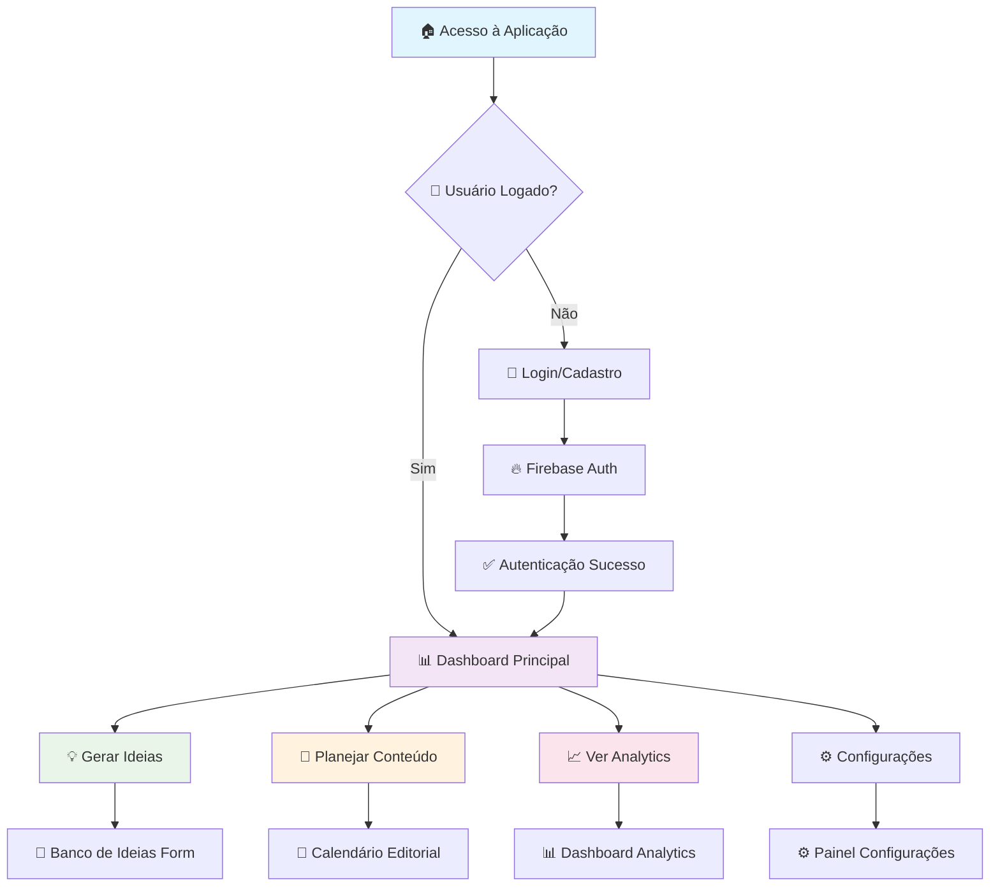
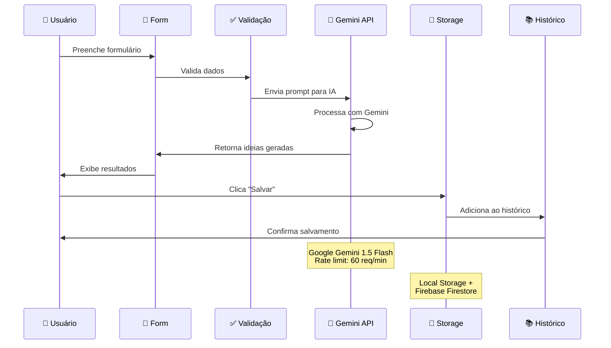
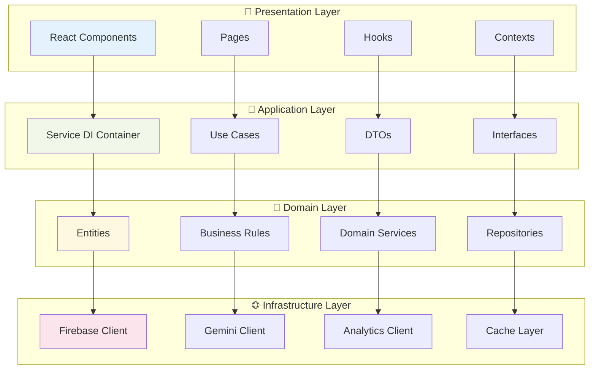
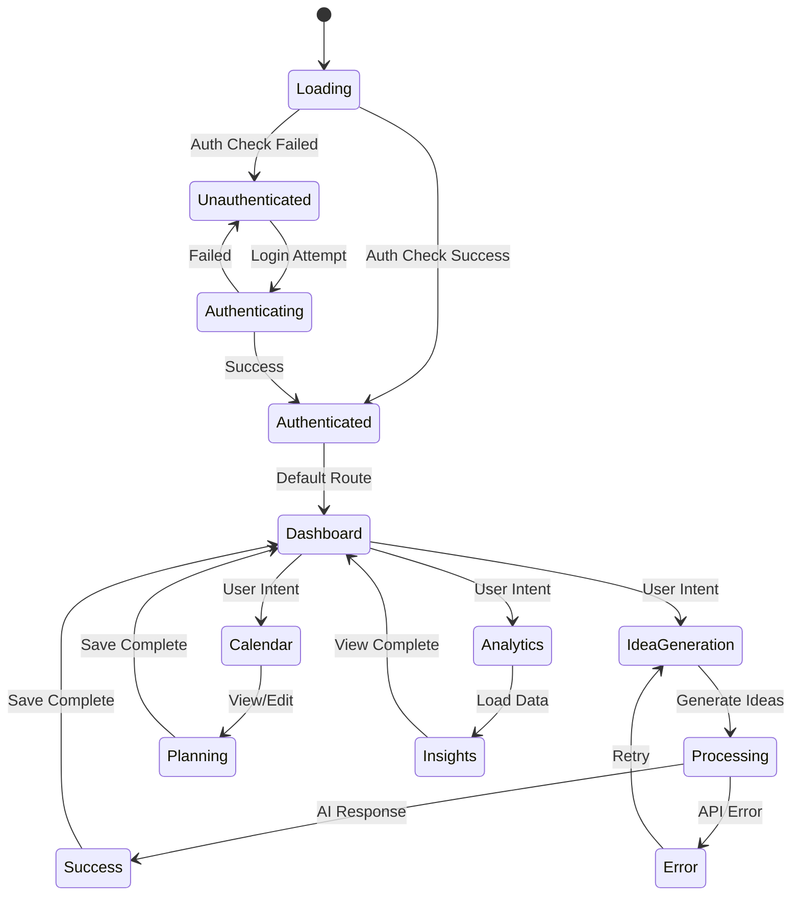
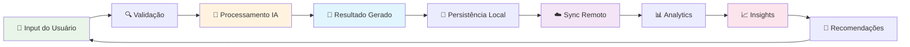
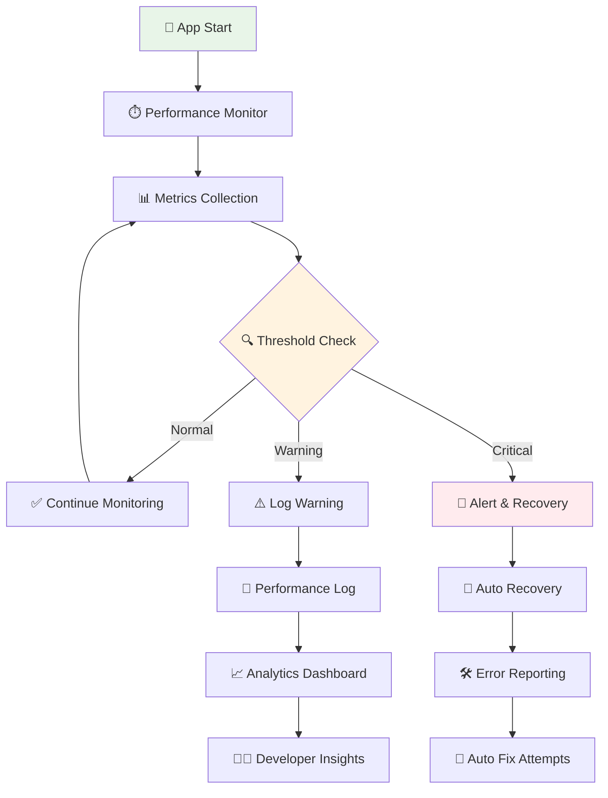
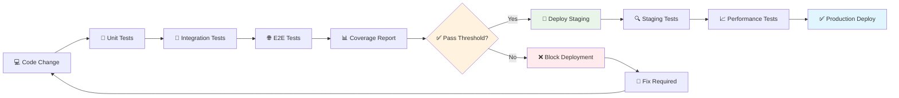

# 🔄 Fluxos do Sistema - Roteirar IA

## 📊 Visão Geral dos Fluxos

Este documento contém todos os fluxos críticos do sistema, atualizados automaticamente e versionados junto com o código.

## 🎯 Fluxo Principal do Usuário



## 💡 Fluxo Detalhado: Geração de Ideias



## 🏗️ Arquitetura de Serviços (Clean Architecture)



## 📱 Estados da Aplicação



## 🔄 Ciclo de Vida dos Dados



## ⚡ Performance & Monitoring



## 🧪 Testing Flow



---

## 📋 Como Atualizar Este Documento

Este arquivo é **versionado junto com o código** e deve ser atualizado quando:

1. **Novos fluxos** são implementados
2. **Arquitetura** é modificada  
3. **Integrações** são adicionadas/removidas
4. **Performance** patterns mudam

### Comandos para Regenerar Diagramas:

```bash
# Visualizar no VS Code com Mermaid Preview
code docs/architecture/system-flows.md

# Gerar PNGs automaticamente (se needed)
npm run generate-diagrams
```

### IA Automation:

```typescript
// IA pode detectar mudanças e atualizar automaticamente
const updateFlows = {
  trigger: "Code changes in /src/services/ or /src/components/",
  action: "Regenerate relevant flow diagrams", 
  validation: "Ensure diagrams match current implementation"
}
``` 