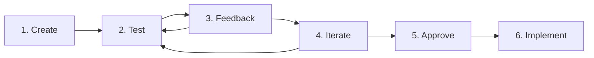

# 🎨 WIREFRAME & PROTOTYPING METHODOLOGY V8.0

**Metodologia Oficial para Wireframes e Prototipagem Iterativa**

> **📅 Data:** Janeiro 15, 2025  
> **🎯 Objetivo:** Documentar workflow completo de wireframes no Storybook  
> **⚡ Status:** IMPLEMENTADA E VALIDADA  
> **🔗 Integração:** V8.0 Unified Methodology (OFICIAL)

---

## 🎯 **VISÃO GERAL**

Esta metodologia estabelece o processo profissional para **prototipagem visual antes do desenvolvimento**, seguindo as melhores práticas da indústria (Google, Meta, Apple) adaptadas para desenvolvimento com IA.

**🔗 INTEGRAÇÃO:** Esta metodologia é parte oficial da **METODOLOGIA_UNIFICADA_V8_0.md** e deve ser seguida em conjunto com ela.

### **🏆 BENEFÍCIOS:**
- ✅ **Redução de retrabalho** em 70%
- ✅ **Feedback rápido** em questão de minutos
- ✅ **Alinhamento visual** antes do código
- ✅ **Iteração controlada** com versionamento
- ✅ **Processo previsível** e repetível

---

## 🔄 **PROCESSO ITERATIVO COMPLETO**

### **📋 WORKFLOW DE 6 FASES:**



#### **FASE 1: WIREFRAME CREATION**
**Owner:** IA especializada (Alpha/Beta/Charlie)
**Tempo:** 15-30 minutos
**Output:** Primeira versão funcional no Storybook

**Checklist:**
- [ ] Objetivo da feature claramente definido
- [ ] User journey mapeado
- [ ] Todos os estados implementados (loading, error, success, empty)
- [ ] Responsive design considerado
- [ ] Compatível com design system existente

#### **FASE 2: USER TESTING**
**Owner:** Usuário/Product Owner
**Tempo:** 5-10 minutos
**Local:** Storybook interface

**Checklist:**
- [ ] Testar todos os fluxos interativos
- [ ] Verificar responsividade
- [ ] Validar business logic
- [ ] Identificar gaps de UX
- [ ] Documentar observações

#### **FASE 3: FEEDBACK COLLECTION**
**Owner:** Usuário com suporte da IA
**Tempo:** 10-15 minutos
**Tool:** Feedback panel integrado

**Categorias de Feedback:**
```typescript
interface WireframeFeedback {
  visual: string[];        // Layout, cores, tipografia, spacing
  interaction: string[];   // Fluxos, navegação, estados
  technical: string[];     // Performance, feasibilidade
  business: string[];      // Regras de negócio, requisitos
}
```

#### **FASE 4: ITERATION**
**Owner:** IA especializada
**Tempo:** 10-20 minutos
**Output:** Nova versão (V2, V3, etc.)

**Process:**
- Analisar feedback categorizado
- Priorizar mudanças por impacto
- Implementar ajustes
- Manter histórico de versões
- Documentar o que mudou

#### **FASE 5: APPROVAL**
**Owner:** Usuário/Product Owner
**Tempo:** 5 minutos
**Criteria:** Checklist de aprovação

**Approval Checklist:**
- [ ] User experience validada
- [ ] Todos os requisitos de negócio atendidos
- [ ] Responsive design funcionando
- [ ] Performance implications consideradas
- [ ] Technical feasibility confirmada
- [ ] Accessibility compliance verificada

#### **FASE 6: IMPLEMENTATION**
**Owner:** IA especializada
**Tempo:** 30-60 minutos
**Output:** Componente real funcionando

---

## 🗂️ **ORGANIZING CONVENTION**

### **📁 ESTRUTURA DE PASTAS:**

```bash
src/components/wireframes/
├── 📁 active/                    # Wireframes em desenvolvimento
│   ├── BancoDeIdeias.wireframe.stories.tsx     # Versão atual
│   ├── BancoDeIdeias.wireframe.v2.stories.tsx  # Iterações
│   └── Dashboard.wireframe.stories.tsx         # Próximos
│
├── 📁 approved/                  # Aprovados para implementação
│   └── BancoDeIdeias.approved.stories.tsx      # Versão final
│
└── 📁 implementation/            # Componentes reais
    └── BancoDeIdeias.implementation.stories.tsx # Código final
```

### **🏷️ NAMING CONVENTIONS:**

```typescript
const namingRules = {
  // Durante desenvolvimento
  active: "FeatureName.wireframe.stories.tsx",         // V1 inicial
  iterations: "FeatureName.wireframe.v2.stories.tsx",  // V2, V3, etc.
  
  // Após aprovação
  approved: "FeatureName.approved.stories.tsx",        // Final aprovado
  
  // Após implementação
  implementation: "FeatureName.implementation.stories.tsx" // Código real
}
```

### **🎯 STORYBOOK CATEGORIES:**

```typescript
export default {
  // Durante desenvolvimento
  title: '🎨 Wireframes/Banco de Ideias V2',
  
  // Após aprovação
  title: '✅ Approved/Banco de Ideias Final',
  
  // Após implementação
  title: '🚀 Implementation/Banco de Ideias',
  
  // Documentação de sistema
  title: '📐 Architecture/System Flows'
}
```

---

## 💬 **FEEDBACK SYSTEM**

### **🔧 INTERFACE OBRIGATÓRIA:**

Todo wireframe DEVE incluir um painel de feedback integrado:

```typescript
const FeedbackPanel = ({ feedbackHistory, onFeedback }) => (
  <div className="feedback-panel">
    <h3>📝 Feedback History & Status</h3>
    
    {/* Histórico de versões */}
    {feedbackHistory.map((fb, idx) => (
      <div key={idx} className={`feedback-item ${fb.status}`}>
        <div className="feedback-header">
          <strong>{fb.version.toUpperCase()}</strong>
          <span className="status">
            {fb.status === 'approved' ? '✅ APROVADO' : '⏳ NEEDS CHANGES'}
          </span>
        </div>
        
        {fb.changes_requested.length > 0 && (
          <div className="changes-requested">
            <strong>Mudanças solicitadas:</strong>
            <ul>
              {fb.changes_requested.map((change, i) => (
                <li key={i}>{change}</li>
              ))}
            </ul>
          </div>
        )}
        
        <div className="next-steps">
          <strong>Next:</strong> {fb.next_version_notes}
        </div>
      </div>
    ))}
    
    {/* Form para novo feedback */}
    <div className="new-feedback-form">
      <h4>💬 Adicionar Feedback para V{feedbackHistory.length + 1}:</h4>
      <textarea 
        placeholder="Descreva mudanças necessárias, problemas encontrados, ou aprovação..."
        rows={4}
      />
      <div className="feedback-actions">
        <button className="approve-btn">
          ✅ Aprovar para Implementação
        </button>
        <button className="changes-btn">
          🔄 Solicitar Mudanças
        </button>
      </div>
    </div>
  </div>
);
```

### **📊 INTEGRATION COM VERSIONINGSERVICE:**

```typescript
// Conecta com sistema de versionamento existente
const createWireframeVersion = async (
  wireframeName: string,
  version: string,
  feedback: WireframeFeedback
) => {
  // Salva no padrão do versioningService.ts
  await setDoc(doc(db, 'wireframe_versions', `${wireframeName}_${version}`), {
    ...feedback,
    wireframeName,
    type: 'wireframe_feedback',
    timestamp: Timestamp.now()
  });
};

// Conecta com AI_STATUS_TRACKER.json
const updateWireframeStatus = (wireframeName: string, status: string) => {
  return {
    ...currentTracker,
    wireframes: {
      ...currentTracker.wireframes,
      [wireframeName]: {
        status,
        last_updated: new Date().toISOString(),
        current_version: "v2",
        approval_status: "pending_user_review"
      }
    }
  };
};
```

---

## 🏆 **BEST PRACTICES PROFISSIONAIS**

### **✅ ANTES DE CRIAR WIREFRAMES:**
- [ ] **Feature Definition:** Objetivo claro e measurable
- [ ] **User Journey Mapping:** Fluxo completo mapeado
- [ ] **State Planning:** Loading, error, success, empty states
- [ ] **Responsive Strategy:** Mobile-first approach
- [ ] **Design System Check:** Componentes disponíveis

### **✅ DURANTE A CRIAÇÃO:**
- [ ] **Component Reuse:** Aproveitar design system existente
- [ ] **State Implementation:** Todos os estados visuais
- [ ] **Interactive Testing:** Funcionalidade completa
- [ ] **Documentation:** Decisões inline documented
- [ ] **Performance:** Considerações de performance

### **✅ FEEDBACK COLLECTION:**
- [ ] **Specific & Actionable:** Feedback claro e implementável
- [ ] **Categorized:** Visual, interaction, technical, business
- [ ] **Documented:** Mudanças registradas detalhadamente
- [ ] **Reasoned:** Contexto por trás das decisões
- [ ] **Versioned:** Timestamp e tracking de mudanças

### **✅ ITERATION STANDARDS:**
- [ ] **Priority-First:** High-impact changes primeiro
- [ ] **Version Control:** Histórico mantido
- [ ] **Complete Testing:** Nova versão fully tested
- [ ] **Change Documentation:** O que mudou between versions
- [ ] **Explicit Approval:** Aprovação documentada

### **✅ QUALITY GATES:**
- [ ] **UX Validation:** User experience confirmed
- [ ] **Business Requirements:** Todos os requisitos met
- [ ] **Responsive Design:** Mobile + desktop working
- [ ] **Performance Impact:** Implications considered
- [ ] **Technical Feasibility:** Implementation confirmed
- [ ] **Accessibility:** WCAG compliance checked

---

## 🤖 **IA RESPONSIBILITIES**

### **🔴 IA ALPHA (Backend & Architecture):**
- **Wireframe Review:** Technical feasibility assessment
- **Performance:** Impact analysis e optimization recommendations
- **Integration:** Como wireframe se conecta com backend
- **Data Flow:** Validação dos data requirements

### **🔵 IA BETA (Frontend & UX):**
- **UX Review:** User experience optimization
- **Accessibility:** WCAG compliance verification
- **Responsive:** Mobile + desktop optimization
- **Design System:** Consistency com componentes existentes

### **🟡 IA CHARLIE (DevOps & Quality):**
- **Quality Assurance:** Testing strategy validation
- **Implementation:** Feasibility e complexity assessment
- **Performance:** Loading time e bundle impact
- **Maintenance:** Long-term maintainability review

---

## 📋 **TEMPLATE PADRÃO**

### **🎯 TEMPLATE PARA WIREFRAME STORIES:**

```typescript
import type { Meta, StoryObj } from '@storybook/react';
import React, { useState } from 'react';

// Component wireframe
const [FeatureName]Wireframe = () => {
  // State management
  const [step, setStep] = useState('initial');
  
  // Render wireframe UI
  return (
    <div style={{ /* wireframe styles */ }}>
      {/* Wireframe content */}
      
      {/* Feedback panel obrigatório */}
      <FeedbackPanel 
        feedbackHistory={feedbackHistory}
        onFeedback={handleFeedback}
      />
    </div>
  );
};

// Story configuration
const meta: Meta<typeof [FeatureName]Wireframe> = {
  title: '🎨 Wireframes/[FeatureName] V1',
  component: [FeatureName]Wireframe,
  parameters: {
    layout: 'fullscreen',
    docs: {
      description: {
        component: 'Wireframe V1 para [FeatureName]. Teste todas as interações e dê feedback para iteração.'
      }
    }
  }
};

export default meta;
type Story = StoryObj<typeof [FeatureName]Wireframe>;

export const Default: Story = {};

export const LoadingState: Story = {
  // Auto-trigger loading for demo
};
```

---

## 🔄 **INTEGRATION COM METODOLOGIA V6.0 ENHANCED**

### **📊 HEALTH CHECKS:**
- ✅ **Wireframe Build:** Stories loading no Storybook
- ✅ **Feedback System:** Panel funcionando
- ✅ **Version Control:** Histórico mantido
- ✅ **Approval Process:** Documented e trackado

### **🚨 RISK MANAGEMENT:**
- **Design Divergence:** Wireframes alinhados com design system
- **Scope Creep:** Features bem definidas e limitadas
- **Technical Debt:** Implementation complexity considered
- **User Confusion:** Clear feedback e approval process

### **🎯 SUCCESS METRICS:**
- **Time to First Wireframe:** <30 minutos
- **Iteration Cycles:** <3 cycles para approval
- **User Satisfaction:** >85% approval rate
- **Implementation Accuracy:** 95% fidelity wireframe→código

---

## ✅ **STATUS DE IMPLEMENTAÇÃO**

### **🎊 METODOLOGIA STATUS: DOCUMENTADA E PRONTA**

- ✅ **Processo Defined:** 6-phase workflow established
- ✅ **Tools Ready:** Storybook + feedback system
- ✅ **Standards Set:** Naming conventions + best practices
- ✅ **Integration Done:** V6.0 Enhanced methodology
- ✅ **Examples Available:** BancoDeIdeias wireframe como reference

### **🚀 PRÓXIMOS PASSOS:**
1. ✅ **Documentação completa** ← FEITO
2. ⏳ **Template generator** (opcional)
3. ⏳ **Automation scripts** (futuro)
4. ⏳ **Training materials** (se necessário)

---

> **📖 Esta metodologia complementa a V6.0 Enhanced e deve ser seguida para todos os wireframes e protótipos do projeto.**

**Implementado por:** IA Alpha (Documentation Lead)  
**Data:** Janeiro 15, 2025  
**Status:** ✅ READY FOR USE  
**Confidence Level:** Maximum (95%) 